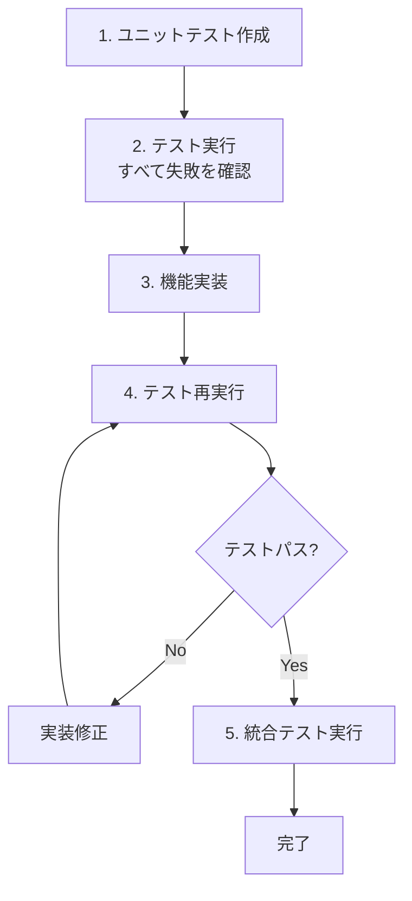

# Agent Communication MCP Server - TDD実行順序

## 概要

Test-Driven Development (TDD) アプローチを採用し、テストを先に作成してから実装を行います。これにより、仕様に準拠した高品質なコードを保証します。

## 実行フロー



## Phase 1: テスト作成（並列実行可能）

### 1-1. 各機能のユニットテスト作成

3つのターミナルで同時実行：

```bash
# ターミナル1：メッセージング機能のテスト
./tasks/continue-task.sh agent-a-messaging-tests

# ターミナル2：ルーム機能のテスト
./tasks/continue-task.sh agent-b-rooms-tests

# ターミナル3：管理機能のテスト
./tasks/continue-task.sh agent-c-management-tests
```

### 1-2. 統合テスト作成

ユニットテスト完成後：

```bash
# 統合・E2Eテストの作成
./tasks/continue-task.sh agent-d-integration-tests
```

### 1-3. テスト実行（失敗確認）

```bash
# すべてのテストを実行（すべて失敗することを確認）
npm test
```

## Phase 2: 機能実装（並列実行可能）

### 2-1. 各機能の実装

テスト作成完了後、3つのターミナルで同時実行：

```bash
# ターミナル1：メッセージング機能
./tasks/continue-task.sh agent-a-messaging

# ターミナル2：ルーム・プレゼンス機能
./tasks/continue-task.sh agent-b-rooms

# ターミナル3：管理機能
./tasks/continue-task.sh agent-c-management
```

### 2-2. 単体テスト実行

各機能実装後、対応するテストを実行：

```bash
# 個別実行
npm run test:messaging
npm run test:rooms
npm run test:management

# または全体実行
npm test
```

## Phase 3: 統合

### 3-1. 統合実装

すべての機能テストがパスしたら：

```bash
# 統合実装
./tasks/continue-task.sh agent-d-integration
```

### 3-2. 全テスト実行

```bash
# 全テストスイート実行と検証
./tasks/continue-task.sh run-all-tests
```

## テストファイル構造

```
tests/
├── messaging/
│   ├── unit/
│   │   ├── MessageService.test.ts
│   │   ├── MessageStorage.test.ts
│   │   └── MessageCache.test.ts
│   ├── integration/
│   │   └── messaging-flow.test.ts
│   └── performance/
│       └── throughput.test.ts
├── rooms/
│   ├── unit/
│   │   ├── RoomService.test.ts
│   │   ├── RoomStorage.test.ts
│   │   ├── PresenceService.test.ts
│   │   └── PresenceStorage.test.ts
│   ├── integration/
│   │   └── room-lifecycle.test.ts
│   └── load/
│       └── multi-room.test.ts
├── management/
│   ├── unit/
│   │   ├── ManagementService.test.ts
│   │   ├── StatsCollector.test.ts
│   │   └── DataScanner.test.ts
│   └── integration/
│       └── stats-accuracy.test.ts
├── integration/
│   ├── adapters/
│   │   ├── MessagingAdapter.test.ts
│   │   ├── RoomsAdapter.test.ts
│   │   └── ManagementAdapter.test.ts
│   └── scenarios/
│       └── room-messaging-flow.test.ts
└── e2e/
    ├── full-flow.test.ts
    └── mcp-tools.test.ts
```

## 成功基準

### テストカバレッジ
- 単体テスト: 90%以上
- 統合テスト: すべての主要フロー
- E2Eテスト: 全9つのMCPツール

### パフォーマンス
- メッセージング: 1000msg/秒
- ルーム管理: 100ルーム×50ユーザー

### 品質
- すべてのテストがグリーン
- spec.mdの全仕様を満たす
- エラーハンドリングが適切

## タイムライン（目安）

1. **0-30分**: テスト作成（Phase 1）
2. **30-120分**: 機能実装（Phase 2）
3. **120-150分**: 統合とテスト検証（Phase 3）

## トラブルシューティング

### テストが失敗し続ける場合

```bash
# 詳細なエラーログを確認
npm test -- --reporter=verbose

# 特定のテストのみ実行
npm test -- MessageService.test.ts

# デバッグモードで実行
npm test -- --inspect-brk
```

### カバレッジが不足している場合

```bash
# カバレッジレポートを生成
npm run test:coverage

# HTMLレポートを開く
open coverage/index.html
```

## 利点

1. **品質保証**: 仕様に基づいたテストが先にあるため、実装が仕様を満たすことを保証
2. **リグレッション防止**: 変更時に既存機能が壊れていないことを即座に確認
3. **ドキュメント性**: テストがAPIの使用例として機能
4. **並列開発**: テストが独立しているため、複数のエージェントが同時に作業可能

## 注意事項

- テスト作成時は実装が存在しないため、すべて失敗することが前提
- モックを適切に使用して、他の機能への依存を切り離す
- パフォーマンステストは実装完了後に意味を持つ