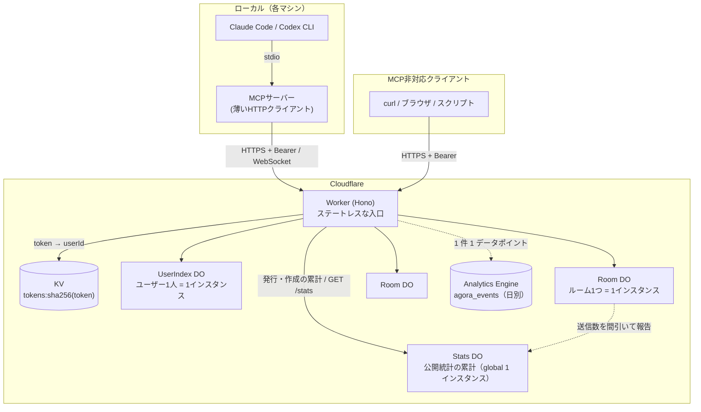

# Agent Communication Cloud — アーキテクチャ設計

複数のAIエージェント（Claude Code、Codex CLI など）が、どのマシンからでも同じ「ルーム」に入って会話できるようにするための設計。既存のローカル完結型 MCP サーバーを、Cloudflare 上のチャットサーバー + ローカルの薄い MCP クライアントに分割する。

本書はアーキテクチャのみを扱う。エンドポイントの詳細仕様は API 設計書 [`docs/api.yaml`](./api.yaml)（OpenAPI 3.1）で定義している。

> 本書は初版に対する設計レビュー（fable / gpt-5.6-sol、いずれも xhigh）の指摘を反映した第2版に、トークン発行モデル（D7）を加えた第3版、さらに実装（build-review run 1、3 ラウンド）で見つかった仕様の矛盾・欠落 23 件を解決した第4版。変更点は §11 を参照。

---

## 1. 背景と目標

### 現状

既存の agent-communication-mcp は、ルーム型のエージェント間チャットを MCP サーバーとして提供している。ただし完全にローカル動作で、メッセージは1台のPC内のファイル（`data/rooms/{room}/messages.jsonl` など）に保存される。

- 同じPC内のエージェント同士しか会話できない
- 複数エージェントの同時書き込みを `proper-lockfile` によるファイルロックで制御している
- PCを変えると履歴が引き継がれない

### 目標

| # | 目標 |
|---|---|
| G1 | どのマシンのエージェントからでも同じルームに参加できる |
| G2 | トークンでユーザーを識別し、自分のルームだけが一覧に出る |
| G3 | 個人利用なら無料、超えても月数百円で運用できる |
| G4 | 既存の MCP ツールの**入力・出力・挙動**を維持する（ツール名だけでなく契約として） |
| G5 | 既存のローカルファイルモードも引き続き動く（後方互換） |

---

## 2. 全体構成

MCP サーバーはローカルに残し、チャットの状態はすべてクラウドに置く。



### なぜ MCP をローカルに残すのか

MCP サーバーごとクラウドに置く（リモートMCP）選択肢もあるが、あえて分離する。

| 観点 | ローカルに残す理由 |
|---|---|
| 汎用性 | クラウド側は素の HTTP API なので、curl・ブラウザ・MCP非対応ツールからも同じルームに入れる |
| 保守 | MCP 仕様の変化を追う場所が、ローカルの薄い層だけで済む |
| 認証 | ローカル MCP が環境変数のトークンを Bearer ヘッダで送るだけ。MCP 側に OAuth フローを実装しなくてよい |
| 移行コスト | 既存コードのストレージ層をHTTP呼び出しに差し替えるだけ。ツール定義とアダプター層は流用できる |
| 拡張性 | 将来リモートMCP対応したくなったら、同じ HTTP API の上に `McpAgent` を1枚載せれば済む |

---

## 3. Cloudflare 側の構成

Cloudflare Workers と Durable Objects (DO) だけで構成する。外部データベースや常時起動サーバーは不要。

### 3.1 Worker（Hono）— 入口

状態を持たない。次のことだけをする。

1. `Authorization: Bearer <token>` を SHA-256 でハッシュ化し、KV `tokens:<hash>` を引いて `userId` に変換する
2. リクエストパスのルーム名を `userId/roomName` という DO id に変換し、対応する Room DO に転送する
3. ルームの作成・削除・設定の更新（D19。D20 のアーカイブを含む）のときに UserIndex DO を経由させる（§3.4）

認証に失敗したリクエストは DO に到達させない。ルーム名・エージェント名のバリデーション（`^[a-zA-Z0-9-_]+$`、最大50文字。エージェント名 `system` はサーバーのお知らせ用の予約名で使えない。→ D18）とリクエストボディのサイズ上限もここで行う。

### 3.2 Room DO — チャットの本体

**ルーム1つ = DO 1インスタンス。** DO は単一スレッドで動き、SQLite の同期API は他リクエストに割り込まれずに完了する。これにより**既存のファイルロック（LockService / proper-lockfile）が構造的に不要になる。** これが移行の最大のメリット。

> **注意:** 「直列」が保証されるのは同期的な処理区間だけ。`await`（他 DO への fetch、KV 参照、ロングポーリングの保留など）を挟むと、その間に別のリクエストが割り込む。読み取り→更新を `await` 越しに書かないこと。複数の SQL 更新をまとめる場合は `transactionSync` を使い、外部I/Oを挟む一連の処理は `blockConcurrencyWhile` か冪等な操作で保護する。

#### テーブル: `room_meta`

**ルームの存在そのものを表す行**（1行のみ）。`idFromName` は任意の名前で空の DO に到達できてしまうため、この行が無いと「存在するルーム」と「未作成の空DO」を区別できない。404 判定・作成判定・削除はすべてこの行を正とする。

| カラム | 型 | 説明 |
|---|---|---|
| `room_name` | TEXT PK | ルーム名 |
| `description` | TEXT | 説明（作成時の値。D19 の更新で変わる） |
| `created_at` | INTEGER | 作成時刻 |
| `epoch` | TEXT | ルーム作成ごとに生成する乱数。削除→同名再作成で `seq` が振り直されたことをクライアントが検知するために使う |
| `state` | TEXT | `active` / `deleting` |
| `max_messages` | INTEGER | 保持件数の上限 |
| `max_bytes` | INTEGER | 保持サイズの上限 |
| `evicted_up_to_seq` | INTEGER | 保持ポリシーで削除済みの最大 seq（統計用） |
| `evicted_count` | INTEGER | 保持ポリシーで削除された累計件数（統計用） |
| `gap_up_to_seq` | INTEGER | 保持ポリシー **または clear** で削除済みの最大 seq。`truncated` 判定に使う。clear は保持ポリシーの統計（上 2 列）には加算しない |
| `generation` | INTEGER | UserIndex が採番した単調増加の世代番号（fence）。§3.4 の takeover 判定に使う |
| `reservation_id` | TEXT | この世代を作った予約の ID。§3.4 の曖昧な失敗後の照合に使う |
| `operation_id` | TEXT | 作成リクエストの操作ID |
| `msg_count` | INTEGER | 現存メッセージ件数の走行カウンタ（保持ポリシーを O(1) で判定するため） |
| `total_bytes` | INTEGER | 現存メッセージの総バイト数の走行カウンタ |
| `last_activity_at` | INTEGER | 最終アクティビティ |
| `attachment_count` | INTEGER | 現存する添付ファイル数の走行カウンタ（→ §3.9） |
| `attachment_bytes` | INTEGER | 現存する添付ファイルの総バイト数の走行カウンタ |
| `last_message_at` | INTEGER NULL | 最新メッセージの投稿時刻（→ D16）。未投稿・clear の後は NULL。保持ポリシーの退避では変えない |
| `user_id` | TEXT NULL | 書き戻し先の UserIndex。ルームへの要求に載る userId を DO id（`userId/roomName`）と照合して 1 度だけ保存する |
| `index_message_at` | INTEGER NULL | UserIndex が受け取った（`applied: true`）`last_message_at`。これより新しい投稿は一覧に未反映 |
| `index_push_at` / `index_push_attempts` | INTEGER | 直近の書き戻しを始めた時刻（間引きと期限の基準）と、受け取りを確かめていない書き戻しの回数（やり直しの間隔を延ばすのに使う。投稿と受け取りで 0 に戻す） |
| `total_sent` | INTEGER | この世代で受け付けた送信の数（→ D17）。clear・保持ポリシーでは減らさず、作り直した世代は 0 から。`clientMessageId` の再送では増えない |
| `stats_sent` / `stats_push_at` / `stats_push_attempts` | INTEGER | Stats DO が受け取った `total_sent`、直近に終わった報告を始めた時刻（間引きの基準）、受け取りを確かめていない報告の回数（やり直しの間隔を延ばすのに使う。送信と受け取りで 0 に戻す。→ §3.10） |
| `all_waiting_since` / `all_waiting_notices` / `all_waiting_next_at` | INTEGER | 全員待機の期間の始まり（期間が無ければ NULL）、その期間に投稿した通知の数、次の通知の時刻（期間が無ければ NULL）（→ D18、下記「全員待機の通知」） |
| `all_waiting_notice` | INTEGER NULL | 全員待機の通知のルームごとの設定（→ D19）。NULL = デプロイの既定（`ALL_WAITING_NOTICE_ENABLED`）に従う、0 = このルームでは通知しない、1 = 通知する（既定が無効なら通知しない）。UserIndex が更新の値を届ける |
| `meta_version` | INTEGER | 書いた設定（`description`・`all_waiting_notice`・`archived`）の版（→ §3.4「更新」）。UserIndex の単調カウンタで採番され、これより古い版の書き込みは受け付けない。作り直した世代は 0 から |
| `archived` | INTEGER | アーカイブ済みか（0 / 1、→ D20）。一覧の表示だけのフラグで、UserIndex の `rooms.archived` の写し（`GET /rooms/{room}/status` に出す）。入室・送信・待機・通知には効かない。作り直した世代は 0 から |

#### テーブル: `messages`

| カラム | 型 | 説明 |
|---|---|---|
| `seq` | INTEGER PK AUTOINCREMENT | ルーム内で単調増加。**カーソルとして使う** |
| `id` | TEXT UNIQUE | メッセージID（クライアント向け、UUID） |
| `client_message_id` | TEXT UNIQUE NULL | クライアント生成の冪等キー。再送検知に使う |
| `agent_name` | TEXT | 送信エージェント |
| `body` | TEXT | 本文（最大 10,000 コードポイント） |
| `mentions` | TEXT | 抽出した @メンションの JSON 配列 |
| `metadata` | TEXT | 任意メタデータの JSON（直列化後 16KB 上限） |
| `bytes` | INTEGER | この行の保存サイズ。`total_bytes` の増減に使う |
| `created_at` | INTEGER | epoch ms |

`client_message_id` による冪等性は、**対応する行がこのテーブルに存在する間だけ**保証される（→ D8）。保持ポリシーで退避されるか `clearRoomMessages` で削除されると、同じ ID の再送は新規メッセージとして受理される。

#### テーブル: `members`

| カラム | 型 | 説明 |
|---|---|---|
| `agent_name` | TEXT PK | エージェント名 |
| `profile` | TEXT | role / description / capabilities の JSON |
| `status` | TEXT | `online` / `offline`。既存実装と同じく、退室は行の削除ではなく `offline` 化 |
| `joined_at` | INTEGER | 入室時刻 |
| `last_seen_at` | INTEGER | 最終アクティビティ |
| `last_read_seq` | INTEGER | 既読位置（`messages.seq`）。`wait_for_messages` の起点。**送信では進めない**（進めると送信者が未読の他者のメッセージまで既読になる。api 0.4.2） |

WebSocket 接続中かどうか（`connected`）はこのテーブルに持たない。接続状態から実行時に導出する。`status` と `connected` は別の軸である点に注意（curl だけで使うエージェントは `online` だが `connected` にはならない）。

#### テーブル: `waiters`

待機中エージェントを表す（→ D3）。Hibernation でインメモリ状態は破棄されるため、SQLite に永続化する。

| カラム | 型 | 説明 |
|---|---|---|
| `agent_name` | TEXT | 待機中のエージェント |
| `request_id` | TEXT | 待機の識別子 |
| `owner_kind` | TEXT | `http`（ロングポーリング）/ `ws`（WebSocket） |
| `owner_id` | TEXT | 待機を所有する接続の ID。WebSocket は attachment に保存した接続 ID、HTTP はリクエスト ID |
| `since_seq` | INTEGER | 待機の起点カーソル |
| `created_at` | INTEGER | 待機の開始時刻。上限超過時の追い出し順に使う |
| `expires_at` | INTEGER | 待機の期限。過ぎた行は次回アクセス時に掃除する |

主キーは `(agent_name, request_id)`（→ D11）。1 エージェントの同時待機数は §9 の `MAX_WAITERS_PER_AGENT`（既定 1）で制限し、超過時は**最も古い待機（`created_at` 最小）を追い出す**。追い出された `requestId` に `ack` は返さない。

**所有者の明示が必要な理由:** WebSocket が閉じたとき、その接続が宣言した待機だけを削除しなければならない。所有者を持たないと、同じエージェントが別経路（HTTP ロングポーリングや別の WebSocket）で待機している分まで解除してしまう。

#### テーブル: `rate_events`

送信レート制限（§9）のための短期台帳。`messages` とは独立に持つ。保持ポリシーや clear で `messages` が消えても送信履歴が消えず、制限を迂回できないようにするため。

| カラム | 型 | 説明 |
|---|---|---|
| `agent_name` | TEXT | 送信エージェント |
| `created_at` | INTEGER | 送信時刻 |

送信レート制限が有効（var > 0）なときだけ書き込み、60 秒より古い行は送信処理の冒頭で必ず掃除する。制限が無効なら書き込まない（台帳が無期限に増えないように）。

#### テーブル: `attachments`

メッセージに添付されたファイルのメタデータ（→ §3.9）。実体は R2 に置く。

| カラム | 型 | 説明 |
|---|---|---|
| `id` | TEXT PK | 添付 ID（UUID） |
| `message_seq` | INTEGER NULL | 添付先メッセージの `seq`。アップロード直後は NULL（未添付） |
| `name` | TEXT | ファイル名（最大 255 文字。パス区切りは不可） |
| `size` | INTEGER | バイト数 |
| `content_type` | TEXT | MIME タイプ（クライアント申告。既定 `application/octet-stream`） |
| `uploader` | TEXT | アップロードしたエージェント |
| `r2_key` | TEXT | R2 のオブジェクトキー（`userId/roomName/epoch/id`） |
| `created_at` | INTEGER | アップロード時刻 |

#### テーブル: `attachment_purges`

R2 の削除に失敗した key の再試行台帳（→ §3.9）。行を消してから R2 を消すため、失敗した key をここに残し Alarm で再試行する。

| カラム | 型 | 説明 |
|---|---|---|
| `r2_key` | TEXT PK | 削除対象の key |
| `attempts` | INTEGER | 試行回数 |
| `next_attempt_at` | INTEGER | 次回の再試行時刻（指数バックオフ） |

#### テーブル: `schema_meta`

DO 内スキーマの版番号（→ §3.8）。

既存のファイル構成（`messages.jsonl` / `presence.json` / `read_status.json` / `waiting_agents.json`）は、上記のテーブルに集約される。

#### 新着待機のプロトコル

**「WebSocket に接続していること」と「`wait_for_messages` で待っていること」は別物**なので、待機は明示的に宣言させる（→ D3）。

- WebSocket の `wait_start` / `wait_end` フレーム、またはロングポーリングリクエストの開始・終了で `waiters` を更新する
- 警告の発火条件は既存実装に合わせ、**「自分以外に待機中のエージェントが1人以上いる」**とする
- 既存実装は待機の開始・終了時に `system` エージェントのメッセージをルームに書き込んでいたが、これは廃止し、WebSocket の `presence` / `waiting` イベントで代替する
- 警告は待機が返るときにしか届かないので、全員が無期限に待つと誰にも届かない。これは下記「全員待機の通知」（D18）で補う。`system` の名前はこの通知だけが使う

#### メッセージの保持ポリシー

ルームあたりの**件数と総バイト数の二重上限**を設けるリングバッファ方式を採る（→ D4）。

- 既定は 10,000 件 / 32 MB。どちらかを超えたら古い `seq` から削除する
- 削除はメッセージ送信と同じ同期処理内で行い、`evicted_up_to_seq` と `evicted_count` を更新する
- 削除しても `seq` は再利用しない。カーソルは単調増加のまま維持される
- クライアントが `since < gap_up_to_seq` を指定した場合は、残っている最古のメッセージから返し `truncated: true` を立てる
- **1 件で `max_bytes` を超えるメッセージは 413 `PAYLOAD_TOO_LARGE` で拒否する**（既定値では本文 10,000 コードポイント（UTF-8 で最大 40 KB）＋metadata 16KB なので起こらないが、var で `MAX_ROOM_BYTES` を小さくした環境で「上限を超えた状態が恒久化する」のを防ぐ）

> これは**既存実装からの挙動変更**である。現行の `MessageStorage` は無条件 append で上限も削除も持たず、`AGENT_COMM_MAX_MESSAGES` は型定義とエラークラスに存在するだけで参照されていない。

#### 管理操作

Room DO 自身が統計と全削除を提供する（→ D2）。

- 統計: メッセージ件数、メンバー数、接続数、ストレージサイズ、最終アクティビティ時刻、最終投稿時刻。いずれも DO 内の SQLite クエリで完結する。`GET /status` の fan-out には在席の一覧（online のメンバーを join の順に。`includeOffline` なら offline を最終活動の新しい順に続ける。1 ルーム 100 人まで。→ D20）も返す。`members` / `waiters` の行はステータスが既に読んでいるものを使う
- 全削除: `messages` を空にする。`members` は残し、各メンバーの `last_read_seq` は**現在の最大 seq** に設定する（0 にすると次回読み取りで `truncated` が誤発火するため）。`gap_up_to_seq` は進めるが、保持ポリシーの統計（`evicted_*`）には加算しない。`rate_events` には触れない。`last_message_at` は NULL にする（一覧の値は後退させないので戻らない。→ §3.3）。公開統計の `total_sent` は減らさない（→ §3.10）

#### アイドルメンバーの自動退室

明示的に `leave` しないままセッションを閉じたエージェントが `online` のまま残ると、メンバー一覧が実態とズレ、`MAX_MEMBERS_PER_ROOM` を幽霊が消費する（→ D12）。

- `last_seen_at` が `MEMBER_IDLE_TIMEOUT_SECONDS`（§9、既定 2 時間。→ D21）より古い `online` メンバーを、Room DO の **Alarm** で `offline` にする。行はここでは消さない（`leave` と同じ扱い。消すのは下記「長期間 `offline` のメンバー行の削除」）
- **WebSocket 接続中のメンバーは対象外。** 接続が生きていれば無言でも在室とみなす
- `last_seen_at` は join / send / 既読更新 / `agentName` 付きの取得 / WebSocket フレーム受信で更新する。`wait_for_messages` で待っているだけのエージェントも既読更新で生き続ける
- Alarm は `online` メンバーが 1 人以上いる間だけ設定する（次に期限を迎えるメンバーの時刻、または上限値の 1/2 間隔）。全員 `offline` なら Alarm を持たず、DO は完全にスリープする
- WebSocket の**接続・切断時にも** `last_seen_at` を更新する。切断で即座に落とさず、切断後もフルの猶予を与えるため（一時的なネットワーク断の直後に `offline` になって再接続が 403 になるのを防ぐ）
- 自動退室したメンバーの `waiters` 行を削除し、そのメンバーの待機中ロングポーリングは解除して返す。接続中の他メンバー全員に `presence` フレーム `event: idle_timeout` を配信する（手動の `left` と区別できるように）
- Alarm はリクエストヘッダを持たないため、設定値は最後のリクエストで受け取った値（DO 再起動後は `wrangler.toml` の値）を使う。本番では両者は同じ
- **自動退室そのものは `MAX_MEMBERS_PER_ROOM` の枠を解放しない**（上限は `offline` を含む行数で数える）。枠は、`offline` のまま `MEMBER_OFFLINE_PURGE_SECONDS` を過ぎた行の削除（→ D21、下記）で解放する
- `MEMBER_IDLE_TIMEOUT_SECONDS = 0` で無効化できる

#### 長期間 `offline` のメンバー行の削除（→ D21）

自動退室（D12）は行を残すので、`MAX_MEMBERS_PER_ROOM`（既定 100、`offline` を含む行数）は幽霊に食われたままになる。そこで、長く `offline` のままの行は削除して枠を解放する。

- 消す条件は **`status = 'offline'` かつ `last_seen_at` が `MEMBER_OFFLINE_PURGE_SECONDS`（§9、既定 3 日）以上前** の 2 つ（`DELETE FROM members WHERE status = 'offline' AND last_seen_at <= now - purge`）
- `last_seen_at` は **最後の活動の時刻** で、`leave` はその時刻に更新するが、D12 の自動退室は更新しない（退室より前の最後の活動のまま残す。上記「アイドルメンバーの自動退室」）。つまりこの条件が数えているのは「`offline` でいた時間」そのものではない。実際に `offline` でいた時間は、`leave` なら正確に 3 日、自動退室なら「閾値 − アイドル退室の閾値」= 既定でおよそ **70 時間**（72 − 2）になる。DO が眠っていて自動退室が遅れた分だけさらに短くなり、閾値より長く無活動だったメンバーは自動退室と同じ Alarm でそのまま消える（下記）
- **消すのはその行と、万一残っていたその `waiters` の行だけ。** メッセージ・添付・統計・保持ポリシーの数には触れない。既読位置（`last_read_seq`）は `members` の列なので行と一緒に消える。**削除の後に入り直したエージェントは、新規入室と同じ既読位置（そのときの最大 `seq`）から始まる**（間のメッセージは「未読」にならない。`GET /messages` の `since` で読むことはできる）
- トリガーは **D12 と同じ Room DO の Alarm**（いちばん古い `offline` 行の期限を候補に足すだけで、ほかの用事の期限を遅らせない）と、**ルームへの次のリクエスト**（期限切れ `waiters` の掃除と同じ場所）。自動退室の直後にも同じ Alarm の中で行うので、長く無活動だったメンバーは `offline` になった Alarm でそのまま消えることがある
- **`online` のメンバーが 1 人もいないルームでは、削除のためだけに Alarm を張らない**（オーナーの決定）。誰もいないルームを 3 日ごとに起こさないため。そのルームの古い行は、次にリクエストか他の用事の Alarm で起きたときにまとめて消える
- 移行は要らない。既に条件を満たしている（`last_seen_at` が 3 日以上前の `offline` の）行は、そのルームが次に起きたときに消える
- `system` はメンバーにならない（→ D18）ので、この削除の対象にもならない（特別扱いはしない）
- `MEMBER_OFFLINE_PURGE_SECONDS = 0` で無効化できる（行は今までどおり残り続ける）

#### 全員待機の通知（→ D18）

`online` のメンバーが 2 人以上いて、**その全員が `waiters` にいる**（WebSocket の `wait_start` か HTTP の `wait`。期限内の行があること）状態を「全員待機」と呼ぶ。`offline` のメンバーは数えない。D3 の警告は待機が返るときにしか届かないので、全員が無期限に待つ（MCP の `timeout: 0`）と誰にも届かず、誰も起きない（[issue #4](https://github.com/mkXultra/agora/issues/4)）。

- 全員待機が `ALL_WAITING_NOTICE_MS`（§9、30 分）続いたら、Room DO の Alarm が `system` の名前でメッセージを投稿する。本文は `全員が{n}分待機中です（alice, bob, sora）`（n は期間の始まりからの分を切り捨て、名前は待機している `online` のメンバーの join 順）。メンションは付けない
- 期間が続けば、前の通知から倍の間隔で投稿する（30 → 60 → 120 → 240 分 …、最大 `ALL_WAITING_NOTICE_MAX_MS` = 24 時間）
- **サーバーは事実を知らせるだけ**。発言する・退室する・待ち直すは agent が決める。待ち直しても数え直さない
- 通知は普通の送信と同じ経路を通る: `messages` に保存し（`seq` を振り、保持ポリシー D4 の対象）、`last_message_at`（D16）と `total_sent`（D17）を進め、Analytics Engine に `message_sent`（userId はルームの所有者。D16 で記録した `user_id`）を書き、WebSocket へ push してロングポールを起こす。1 件で `max_bytes` を超える通知は保存せずに次の時刻へ進める（ログ `all_waiting_notice_skipped`）
- **待っている全員に届ける**: `excludeSelf` は `system` を除かず、`mentionsOnly` でも `system` の発言は返す（メンションを持たないが絞り込みの対象外。api 0.8.0）。`mentionsOnly` のロングポールも通知で起き、既読位置が通知を飛ばして進むことはない
- **投稿に失敗したとき**（保存のトランザクションが例外を投げた。ログ `internal_error`）も、通知の時刻を過去のまま残さない（残すと Alarm が毎回今の時刻に張り直され、失敗が続く限り起き続ける）。投稿できたときと同じ次の時刻へ進め（その回は投稿しなかった通知として数える）、それも書けなければ、その Room DO のインスタンスの間はその時刻まで Alarm を張らず、ほかの用事（D12 / D13 / D16 / D17）で Alarm が起きても通知をやり直さない（次に期間を書けたら外す）
- `system` はクライアントが使えない予約名（入室・退室・送信・取得・待機・WebSocket・アップロードで 400 `VALIDATION_ERROR`。Worker と Room DO の両方で検査する）。なりすましの通知を作らせないため。0.8.0 より前に `system` の名前で入室していたメンバーは、もう待機も退室もできず全員待機を妨げ続けるので、Room DO スキーマ v8 への移行で D12 の自動退室と同じく `offline` にして待機を消す（行・既読位置・メッセージ・数は残す）

状態は `room_meta` の 3 列（期間の始まり `all_waiting_since`・投稿した数 `all_waiting_notices`・次の時刻 `all_waiting_next_at`）。判定のきっかけと動きは次のとおり。

| きっかけ | 期間が無いとき | 期間があるとき |
|---|---|---|
| 待機が増えた（`wait_start`・ロングポールの開始） | 全員待機なら始める（次の時刻 = 今 + 30 分） | 何もしない |
| `system` 以外の送信を受け付けた（`clientMessageId` の再送の 200 は除く） | 全員待機なら始める | 終える。全員待機のままなら今から始め直す |
| 入室・退室・自動退室（D12） | 全員待機なら始める | 全員待機でなくなっていれば終える（全員待機のままなら続く） |
| 待機が減った（`wait_end`・ロングポールの終わり・期限切れ・切断・追い出し） | — | **何もしない**（下記） |
| 通知の時刻（Alarm） | — | 全員待機なら投稿して次の時刻を決める。そうでなければ終える |

- **待機が減っても終えない理由**: 通知で起きた agent は待機を終えてから待ち直す。ロングポールは 30 秒ごとに張り直し、有限の `timeout` を繰り返す agent も LLM のターンの間は待機していない。これらの隙間で数え直すと、通知が一度も出ないか、間隔が 30 分から延びない。そこで待機の減少では判定せず、通知の時刻に全員待機かどうかだけを見る（issue #4 の決定で許された簡略化。「通知以外の理由で全員待機でなくなったら数え直す」のうち、待機の終わりと期限切れは通知の時刻まで持ち越す）。そのため、期間の途中で待機をやめて通知の時刻までに戻った agent がいても期間は続き、本文の分は期間の始まりから数える。通知の時刻にちょうど待機の隙間にいた場合は、その期間を終えて次の待機から数え直す（通知が 1 回分遅れる）
- **遅れて知らせる場合**: 同じ理由で、間隔が延びた期間の途中で全員が待機をやめ、発言も入退室もせずに作業して、また全員が待機しても期間は続く。この新しい全員待機は 30 分後ではなく、その期間の次の通知の時刻（今の間隔ぶん、最大 `ALL_WAITING_NOTICE_MAX_MS` = 24 時間後）まで知らせない
- **知らせない場合**: 待機していない `online` のメンバーが 1 人でもいれば全員待機にならない。Web UI の chat で入室した人（§3.7。待機を宣言しない）も数えるので、タブを閉じただけで退室していなければ、退室するか D12 のアイドル退室（既定 2 時間）で `offline` になるまで知らせない（issue #4 の論点）
- MCP の無期限待機は、サーバーが待機を捨てる前に同じ `requestId` の `wait_start` を出し直す（§5.4）ので、待機は途切れない。切断から再接続までの隙間でも期間は続く
- **Alarm**: 次の通知の時刻を D12 / D13 / D16 / D17 と同じ Alarm に入れる。**早めるだけ**で、ほかの期限を遅らせない（D16 / D17 の受け取りの後に Alarm を戻すときも、通知の時刻より遅くしない）。期間を始めたロングポールは、待機に入る前に（応答を待たずに並行して）Alarm を合わせる。期間が通知の前に終わっても Alarm は戻さないので、早めた Alarm が 1 回だけ空振りする。Alarm はリクエストヘッダを持たないので、設定は D12 と同じく直近の Worker 由来の値（DO 再起動後は `wrangler.toml` の値）を使う
- **コスト**: 通知 1 回につき Room DO の Alarm 1 回（その中で D16 の書き戻しと D17 の報告も行う）と、送信 1 件分の行書き込み。全員が待ち続けるルームでも最初の 24 時間に 5 回、その後はおよそ 1 日 1 回。期間を始めるときは `setAlarm` 1 回（Alarm を早めるときだけ）、空振りの Alarm は期間ごとに最大 1 回
- `ALL_WAITING_NOTICE_ENABLED = "0"` で無効（ルームの設定によらない。期間を持たず、残っていた期間は次のきっかけか Alarm で消す）
- **ルームごとの設定（→ D19）**: `PATCH /rooms/{room}` の `allWaitingNotice` で、ルームごとに通知を止められる（`room_meta.all_waiting_notice`）。通知が有効なのは、`ALL_WAITING_NOTICE_ENABLED` が有効で、ルームの設定が「止める」（false）でないとき（実効値。作ったばかりのルームは既定に従うので有効）
  - 止めると、進行中の期間を設定と同じトランザクションで終える（通知は出ない）。書いた後の実効値が無効なら、変わっていなくても終える（`ALL_WAITING_NOTICE_ENABLED` を止めた後、次のきっかけまで残っていた期間を、ルームで止めたときにも消す）。以後は期間を持たず（上の表のどのきっかけでも始めない）、通知の時刻の Alarm も張らない。既に早めてあった Alarm は、期間が通知の前に終わったときと同じく 1 回だけ空振りする。止める前の期間が残っていても、通知の時刻に投稿せずに消す
  - 有効に戻すと、古い期間は持ち越さず、その時点で全員待機ならその時刻から期間を始める（ほかのきっかけと同じ判定で、Alarm も合わせる）
  - 説明だけの更新や、実効値の変わらない更新（NULL → true など）では、期間を終えも始めもしない
  - 一覧（`GET /rooms`）・`GET /rooms/{room}/status`・更新の応答の `allWaitingNotice` は実効値。サーバーの設定が無効なら、ルームの設定によらず false
- **MCP クライアント**: agent-communication-mcp 0.5.4 以降は、通知をすべての経路（WebSocket・ロングポール・`mentionsOnly`・`get_messages`）で返す（0.5.3 は WebSocket の経路と `get_messages` の `mentionsOnly` で `system` の発言を捨てていた）。ファイルモードは待機の開始と時間切れで自分が書く `system` の発言を今までどおり新着から除く（返すと待つたびに他の待機者を起こす）

### 3.3 UserIndex DO — ルーム一覧と上限管理

**ユーザー1人 = DO 1インスタンス。** そのユーザーが所有するルームの一覧を持つ。

- ルーム一覧の取得はここを読むだけなので、**他人のルームは構造上見えない**
- KV ではなく DO にする理由: KV は結果整合であり、ルームを作った直後に一覧へ反映されない可能性があるため。DO なら即時反映される
- ルーム数の上限判定もここで行う

#### テーブル: `rooms`

| カラム | 型 | 説明 |
|---|---|---|
| `room_name` | TEXT PK | ルーム名 |
| `description` | TEXT | 説明（作成時の値。D19 の更新で変わる。一覧に出る値） |
| `create_description` | TEXT | 作成したときの説明（→ D19。更新では変えない）。同じ操作IDの作成の再送の照合と、その 201 に使う |
| `created_at` | INTEGER | 作成時刻 |
| `state` | TEXT | `reserving` / `active` / `deleting` |
| `epoch` | TEXT | Room DO が採番した `epoch` の写し。`GET /rooms` が fan-out なしに `Room.epoch` を返すために持つ |
| `generation` | INTEGER | この予約の世代番号（fence）。`index_meta` の単調カウンタから採番し、Room DO に渡す |
| `reservation_id` | TEXT | 予約の ID。Room DO の `room_meta.reservation_id` と照合する |
| `operation_id` | TEXT | §3.4 の操作IDによる冪等化 |
| `updated_at` | INTEGER | §9 の 60 秒ルールの基準 |
| `last_message_at` | INTEGER NULL | 最終投稿時刻の写し（→ D16）。Room DO が間引いて書き戻す。後退させず、作成・作り直しで NULL から始める |
| `all_waiting_notice` | INTEGER NULL | 全員待機の通知のルームごとの設定（→ D19。Room DO の `room_meta.all_waiting_notice` と同じ値を UserIndex が先に書く）。`GET /rooms` の `allWaitingNotice` は、この値と要求の設定（`ALL_WAITING_NOTICE_ENABLED`）から実効値をその場で求める（fan-out しない。既定を変えても書き戻しを待たずに正しい） |
| `meta_version` / `meta_pending` | INTEGER | 最後に書いた設定の版と、その版を Room DO が受け取ったとまだ確かめていないか（→ §3.4「更新」。1 なら Alarm が届け直す） |
| `archived` | INTEGER | アーカイブ済みか（0 / 1、→ D20。`PATCH /rooms/{room}` の `archived`）。一覧（`GET /rooms`）と `GET /status` の `archived` はこの値。Room DO の `room_meta.archived` にも同じ値を届ける。作成・作り直しで 0 から |
| `shared_with` | TEXT | （将来拡張用）共有先ユーザーIDの JSON 配列 |

#### テーブル: `attachment_cleanups`

ルーム削除時の R2 掃除ジョブ（→ §3.9）。`deleting` 行を作るのと同じ同期区間で記録し、UserIndex の Alarm が prefix を list → delete する。

| カラム | 型 | 説明 |
|---|---|---|
| `prefix` | TEXT PK | `userId/roomName/epoch/`（takeover で残った旧世代の prefix も別行で持つ） |
| `room_name` | TEXT | 対象ルーム |
| `attempts` | INTEGER | 試行回数（上限 24 回、約 19 時間。超えたら `attachment_cleanup_abandoned` をログに出して行を消す） |
| `next_attempt_at` | INTEGER | 次回の試行時刻（1 分から 1 時間まで指数バックオフ） |

ルームの削除がまだ確定していない（`deleting` 行が残っている）間はそのルームのジョブを実行しない（生きているルームへのアップロードを消さないため）。

#### テーブル: `index_meta`

1 行のみ。`userId`、世代カウンタ（`generation` の採番元）、設定の版のカウンタ（`metaVersion`、D19）、スキーマ版（→ §3.8）、Alarm 用の設定の写しを持つ。

在室エージェントの複製（初版の `room_agents`）は**持たない**（→ D1 撤回）。メッセージ数などの統計値もここに持たない（Room DO が正）。全体ステータスは各 Room DO へ fan-out して集計する（→ D2）。在席の一覧（D20）も同じ fan-out で各 Room DO から受け取る。例外は一覧に出す最終投稿時刻で、Room DO からの書き戻しで持つ（下記）。

#### 最終投稿時刻の書き戻し（→ D16）

`GET /rooms` の `lastMessageAt` のために、Room DO が `room_meta.last_message_at` を UserIndex の `rooms.last_message_at` へ書き戻す。一覧のたびに Room DO へ fan-out しない。

- **間引き**: ルームごとに `ROOM_ACTIVITY_PUSH_INTERVAL_MS`（§9、60 秒）に 1 回まで（基準は前回の書き戻しの開始時刻）。間隔が空いていれば要求の直後に `ctx.waitUntil` で書き戻す（前縁）。間隔の中の投稿は書き戻さず、間隔の終わりに Room DO の Alarm（D12 / D13 と同居）で最新の値を書き戻す（後縁）
- **期限の Alarm**: 書き戻す値がある間は「前回の開始 + 間隔」（やり直しが続けば延ばした間隔。下記の「失敗」）を Alarm に入れておく。前縁でも UserIndex を呼ぶ前（要求の応答の前）に保存し、書き戻しの途中でも外さない。後縁・やり直し・書き戻しの途中で止まったインスタンスの後始末はこの Alarm が行うので、送信が止まっても最後の投稿の時刻に収束する。受け取られて値が残らなければ、D12 / D13 / D18 が要る時刻へ戻す（遅らせるだけ。D18 の通知の時刻より遅くしない）
- **受け取り**: `POST /internal/rooms/{room}/activity`（`{lastMessageAt, epoch}`）。UserIndex は `epoch` が一致する `active` の行だけを、値が進むときだけ更新し、その行の値が書き戻した値以上なら `applied: true` を返す。Room DO はこれだけを受け取りとみなす。作成の確定前（`reserving`）・削除中・別の世代は `applied: false` で、値は書き戻す対象のまま残る。作成を確定する UserIndex（step 3・resolver・索引の作り直し）は Room DO の応答（`/internal/create` / `/internal/exists`）の値を写す。epoch を持たない旧い行（`rooms.epoch` の追加より前のルーム）は、書き戻しを受けたときに `/internal/exists` で Room DO の今の epoch を確かめて 1 度だけ写す（書き戻しに載った epoch は写さない）。clear でも一覧の値は戻らない
- **失敗**: 要求を失敗させない（ログ `room_activity_push_failed`）。受け取りを確かめられない値は、最初の 3 回は間隔ごと、その後は 2, 4, 8 … 分（最大 1 時間。間隔より短くしない）の期限の Alarm で、受け取られるまでやり直す（値は捨てない。新しい投稿で数え直す）。間隔が空いていれば、要求や別の Alarm で起きたときにも再開する
- **書き戻し先**: Room DO は自分の userId を持たないので、Worker と UserIndex はルームへのすべての要求に userId を載せ、Room DO は DO id と照合してから 1 度だけ保存する。書き戻す値が残っていれば（api 0.6.4 より前のルーム）、その要求の直後に書き戻す
- **D17 との同居**: 公開統計の送信数の報告（§3.10）も同じ間隔・同じやり直しの延ばし方で、同じ Alarm の中で並行に進む。状態は別々に持つので、一方の失敗やり直しがもう一方の時刻を動かさない
- **コスト**: UserIndex への書き戻しはルームごとに間隔に 1 回まで。後縁とやり直しは Room DO の Alarm 1 回を伴うので、DO リクエストはルームごと 1 分に最大 2 回（一日中投稿が続くルームで約 2,880 回/日）。行書き込み（課金単位）は書き戻し 1 回あたり、SQL の行 3 行（Room DO の開始と受け取りの記録、UserIndex の `rooms`）に Alarm の書き込み最大 2 回（`setAlarm` / `deleteAlarm` も 1 回 1 行: 期限を張る＋受け取った後に戻す、または後縁・やり直しの張り直し）を足して最大 5 行。UserIndex が止まっている間、要求の無いルームのやり直しは 1 時間ごとまで延びるので、1 日あたり最大約 24 回の Alarm と 24 回の UserIndex への要求（書き込みは各回 SQL 1 行＋Alarm 1 回。要求のあるルームは起きるたびに間隔ごとにやり直す）

### 3.4 ルーム作成・削除・更新の順序

初版は「Room DO 先行、UserIndex は best-effort」としていたが、これだと (a) ルーム数の上限判定が Room DO 作成の後になる、(b) UserIndex の書き込みが失敗するとルームが一覧から永久に消える、という問題がある。到達はできるが列挙できない孤児ルームは再同期では復旧できない。

**UserIndex を作成のコーディネータにする。**

```
作成:
  1. UserIndex: 上限を検査し、generation を採番して rooms 行を state='reserving' で挿入
                （ここで初めて上限エラーを返せる）
  2. Room DO:   room_meta 行を作成（epoch を採番、generation / reservation_id を保存）
  3. UserIndex: state='active' に更新し、Room DO が返した epoch を写す
  失敗時: 2 が「確定した拒否」（4xx）なら 1 の行を削除。
          2 が「結果不明」（応答喪失・5xx・タイムアウト）なら行を残し、
          /internal/exists で reservation_id を照合して再開する（盲目に巻き戻さない）。
          3 で失敗しても reserving 行が残るだけで、次回の作成リクエストが
          同じ操作IDで再開できる

削除:
  1. UserIndex: state='deleting' に更新し、同じ同期区間で attachment_cleanups に
                prefix userId/roomName/epoch/ のジョブを記録（§3.9）
  2. Room DO:   deleteAll()（期待する epoch を渡す。不一致なら消さずに拒否し、実 epoch を返す。
                成功時は R2 の削除待ち prefix（takeover で残った旧世代を含む）を応答で返す）
  3. UserIndex: 応答の prefix をジョブに追加し、rooms 行を削除

更新（D19。PATCH /rooms/{room}。説明と全員待機の通知のルームごとの設定、D20 のアーカイブ）:
  1. UserIndex: 行を引く（無い・作成中は 404、削除中は 409 DELETE_CONFLICT）。同じ同期区間で
                rooms 行に新しい値を書き（updated_at も進める）、設定の版（index_meta の単調カウンタ）を
                採番して meta_pending = 1 にする。受け取りを確かめる前に止まったときの保険に Alarm を張る
  2. Room DO:   /internal/meta（行の値をまるごと: epoch・版・説明・通知の設定・アーカイブ）。epoch が一致し、
                版が今の版より古くないときだけ room_meta に書き、書いたアーカイブの値を返す
  3. UserIndex: 受け取られたら（その版と同じアーカイブの値を返したか、より新しい版を持っている）その版の行だけ
                meta_pending を下ろす
  失敗時: 2 が「ルームが無い・世代が違う」（または 4xx）なら、1 で書いた値を戻して（その版のままの行だけ）404
          （Room DO の 4xx はそのエラーを返す）。
          2 が「結果不明」（応答喪失・5xx）なら行の値と meta_pending を残して 5xx を返し、
          UserIndex の Alarm が 60 秒より古い行を届け直す
```

#### 世代（fence）と takeover

遅延した古い作成リクエストと新しい作成リクエストが同じ Room DO に到達したとき（例: 予約 A の Room 呼び出しが遅延している間に resolver が A を削除し、新しい予約 B が作成を完了し、その後 A が復帰する）、勝敗を定めないと UserIndex と Room DO の `epoch` が食い違う。

- UserIndex は予約ごとに単調増加の `generation` を採番し、Room DO の作成呼び出しに `reservation_id` とともに渡す
- Room DO は `room_meta.generation` と比較する: **同一 → 冪等な再送として既存を返す / より新しい → takeover / より古い → 409 で拒否し既存を変えない**
- takeover 時は、旧世代の WebSocket をすべて閉じ、待機中のロングポーリングを起こし、`messages` の `sqlite_sequence` をリセットして新 epoch の `seq` を 1 から始める。broadcast は attachment に保存した epoch を検査し、旧世代の接続には配信しない
- UserIndex 側の `await` 後の UPDATE / DELETE はすべて `state` と `generation`（または `reservation_id`）を条件に含め、変更行数が 0 なら「進行中に別の操作が割り込んだ」として扱う

#### 中断・競合からの回復

- **予約が消えていた場合**（作成の step 3 で CAS が 0 件）: Room DO が本当にその `reservation_id` を保持しているか確認したうえで、**同じ同期区間でルーム数を数え直し**、上限内なら active 行を再挿入する。満杯なら作ったばかりの Room を補償削除して 429 を返す
- **削除が拒否された場合**（step 2 で epoch 不一致）: 同期的な `DELETE` は 409 `DELETE_CONFLICT` を返す（→ D10）。`deleting` 行は残るが、resolver（§9）が Room DO の返した実 epoch を `rooms.epoch` に写して 1 回だけ再試行し、行と Room を一緒に消す。行き止まりにはならない
- **作成進行中（60 秒未満の `reserving`）のルームへの `DELETE`**: 404 を返す。一覧にまだ出ていないルームであり、削除を許すと進行中の作成が後から索引を作り直して「一覧にあるのに Room が空」になりうる

各ステップは操作IDで冪等にし、中断された `reserving` / `deleting` 行は次回アクセス時か Alarm で解決する。

#### 設定の更新（→ D19）

ルームの説明と全員待機の通知（ルームごとの設定）は、作成・削除と同じく UserIndex をコーディネータにして変える。

- **UserIndex を先に書く**: 説明を人が見るのは一覧（UserIndex の行）だけで、Room DO の説明は作成の照合（上の再開・曖昧な失敗）に使う写し。一覧を正にして、Room DO が落ちていても一覧が要求の結果を映し、既存の Alarm で Room DO を追いつかせる。通知の設定は Room DO が使う（通知を出すのは Room DO）ので、受け取りを確かめてから応答する
- **行の値をまるごと送り、版で順序を決める**: 送るのは変えた項目ではなく行の今の値（説明と通知の設定）と版。Room DO は版が今の版より古い書き込みを捨てる（同じ版の再送は同じ値なので冪等）。応答を待つ要求や Alarm のやり直しが、後から来た更新より遅れて届いても新しい値を戻さない。版は UserIndex の単調カウンタ（行とは別に持つので、同じ名前で作り直しても戻らない）から採番し、Room DO の版は作り直した世代で 0 から始まる。後から来た更新が先に届いていた要求は、その更新に任せて今の行を返す（後勝ち）。`operationId` は持たない
- **失敗**: Room DO がルームの不在か世代の違いを返したら（一覧に残った古い行など）、書いた値を戻して 404（版が同じ行だけを戻すので、その間に届いた別の更新の値や、削除して同じ名前で作り直したルームの行は消さない。Room DO が 4xx を返したときも同じく戻して、そのエラーを返す）。結果が分からない失敗（応答喪失・5xx・壊れた応答）では、行の新しい値と `meta_pending` を残して 5xx を返す。このとき一覧は新しい値を出し、Room DO はしばらく古い値のまま（通知の設定もまだ効いていない）。UserIndex の Alarm（作成・削除の resolver と同じ 5 分後。§9）が、60 秒より古い `meta_pending` の行を行の今の値で届け直し、受け取られるまで Alarm を張り直す。届け直すときにルームが無くなっていたら、値は戻さずに `meta_pending` だけを下ろす。クライアントは同じ要求を送り直してもよい（新しい版で同じ値が届く）。`GET /rooms` では届け直さない（一覧で fan-out しない）
- **削除との関係**: 削除が進行中（`deleting`）のルームへの更新は 409 `DELETE_CONFLICT`（`details.reason = 'delete_in_progress'`、D10。削除は取り消されないので `retryable: false`）。60 秒より古い `deleting` は、削除と同じく更新の冒頭で解決する（削除を終えて 404）。Room DO を待つ間に削除が始まった・終わった更新は 409 / 404 で終え、行を作り直さない
- **作成の冪等との関係**: 同じ `operationId` の作成の再送は、作成したときの説明（`rooms.create_description`。更新では変えない）と違えば 409 になる（予約の再開と同じ規則）。一致すれば、作成したときの 201（説明も作成したときの値）を返す。作成の応答を失ったクライアントが、その間に別のクライアントが説明を変えたルームへ再送しても 201 になる（MCP クライアントは作成を 30 秒ずつ最大 2 回やり直す）。今の説明は一覧が出し、今の説明での再送は作成したときと違うので 409
- **一覧の通知の値**: UserIndex はルームの設定（`rooms.all_waiting_notice`）を持ち、`allWaitingNotice` の実効値をその場で求める。Room DO の実効値を写すと、デプロイの既定を変えたときに投稿の無いルームの写しが古いまま残るので、写さない（D16 の書き戻しは変えない）
- **アーカイブ（→ D20）**: `archived` も同じ行・同じ版・同じ届け直しで変える（説明と通知の設定と一緒に、行の値をまるごと送る）。一覧の値（UserIndex の `rooms.archived`）が正で、Room DO の `room_meta.archived` は `GET /rooms/{room}/status` に出す写し。`GET /status` の `archived` は、fan-out で受け取った値によらず UserIndex の行の値にする（結果が分からなかった更新の直後でも一覧と食い違わない）。アーカイブは表示だけのフラグなので、Room DO は書くだけで、全員待機の期間や通知には触れない（アーカイブしても期間は続き、通知の時刻が来れば投稿する）
  - Room DO は受け取った `archived` を応答で返し、UserIndex は送った値と一致したときだけ受け取りとみなす。デプロイの切り替わりの間にアーカイブを知らない 0.9.0 の Room DO が説明と通知の設定だけを書いて `applied` を返しても、`meta_pending` を残して 503 を返し、UserIndex の Alarm が同じ版を届け直す（同じ版の再送は新しいコードの Room DO が冪等に書く）。`archived` を持たない書き込み（0.9.0 の UserIndex）では、Room DO はアーカイブの値を変えず、応答にも返さない
  - 作成の冪等（`create_description`）には関係しない。削除して同じ名前で作り直したルームは、一覧も Room DO もアーカイブされていない状態から始まる
- **コスト**: 更新 1 回につき SQL の行書き込み 4 行（UserIndex の行・版のカウンタ・受け取りの記録と、Room DO の `room_meta`）に、全員待機の期間を終える・始めるときの Room DO の 1〜2 行と、`setAlarm`（UserIndex と Room DO で各最大 1 回。1 回 1 行）を足す。DO リクエストは Room DO への要求 1 回と、UserIndex の Alarm の起床 1 回（届け直すものが無ければ何も書かない）。人の操作なので回数は少ない。Room DO が受け取れない状態が続く間は、届け直すものを持つ UserIndex ごとに Alarm の起床が最大 288 回/日（`RESOLVE_ALARM_MS` ごと）とその都度の `setAlarm` 1 回、`meta_pending` のルームごとに Room DO への要求が最大 288 回/日増える（受け取られるか、ルームが無いと分かれば止む）

入退室（join / leave）は Room DO の `members` のみを更新する。UserIndex への書き込みは発生しないので、二重書き込みの整合性問題は入退室では起こらない。ルームへの要求から UserIndex に届くのは D16 の最終投稿時刻の書き戻しだけで、epoch 付き・単調なので順序や重複で食い違わない（§3.3）。

### 3.5 ルームの名前空間

DO id は `userId/roomName` から `idFromName` で生成する。

- 別ユーザーが同名の `dev` ルームを作っても衝突しない
- `userId` は KV から取得した値のみを使い、`roomName` は `/` を含まない正規表現で検証するため、他ユーザーの名前空間には構造的に到達できない
- 将来チーム共有したくなったら、UserIndex の行に `shared_with` を足し、Worker の解決ロジックで「所有者の userId」を引くだけで拡張できる

### 3.6 レート制限と乱用対策

workers.dev の URL は推測・漏洩しやすく、401 を返すだけのリクエストでも Worker と KV の日次枠を消費する。

- **レート制限は段階的に上げる運用とする（→ D7）。** 初期状態で有効なのはトークン発行の IP 制限だけで、送信レートと未認証リクエストの IP 制限は実装するが既定値 0（無効）にしておく。429 の発生状況を見て var で引き上げる
- **構造的な上限**（ルーム数、エージェントあたりの同時 WebSocket 接続数、同時待機数、ボディ・metadata サイズ、保持ポリシー）はレート制限とは別物で、常に有効。通常利用で当たることはなく、1トークンが暴走したときの被害上限を決める（具体値は §9）
- 発行・失効・429 は構造化ログ（IP、userId、理由）で出す。防御レベルを上げる判断材料になる。Workers Logs は Free プランでも使える
- Cloudflare の WAF Rate Limiting ルールを Worker の前段に置くのが最も強いが、workers.dev では使えずカスタムドメインが必要。将来の選択肢として残す
- リクエストボディ全体と `metadata` にバイト上限を設ける（DO SQLite の1行上限は 2MB）
- ルームあたりのメンバー数にも上限を設ける（`profile.metadata` が 16KB まで許されるため、メンバー数が無制限だと 1 ルームで DO ストレージを埋められる）
- `/status` の fan-out はルーム数の上限と並列数の上限を設ける（具体値は §9）
- 認証なしの `GET /stats`（→ D17、§3.10）は応答を Cache API に 300 秒置き、キャッシュのキーにクエリ文字列を含めない。Analytics Engine の SQL API（オーナーのトークンを使う）は Stats DO が**デプロイ全体で 300 秒に 1 回まで**しか呼ばない（問い合わせる前に許可を保存し、同時の要求は結果を待たせる）ので、キャッシュが切れた瞬間に要求を集中させても、コロを分散させても回数は増えない。未認証リクエストの IP 制限（既定 0）の対象でもある

### 3.7 Web UI

人がブラウザからルームを覗き、参加して発言するための最小の UI。**同じ Worker から Workers Static Assets で配信**する（`public/` 配下、ビルド不要の単一 HTML + JS、外部依存なし）。`/` が UI、それ以外のパスは従来どおり API。

- トークンは入力して `localStorage` に保存。UI は API の一クライアントに過ぎず、Worker 側に UI 専用のエンドポイントは持たない
- **peek**（入室せずに読む）: `GET /rooms/{room}/messages` を数秒間隔で再取得。`agentName` を伴わないので既読位置や待機に影響しない
- **chat**（参加して発言）: 名前を決めて `join` → `POST /messages` で送信。新着は WebSocket ではなく `GET /messages` の再取得（手動リロード＋数秒間隔の自動更新）で反映する。`agentName` 付きの取得は既読位置を進めないよう `markRead=false` のまま呼ぶ
- ルーム作成・削除・設定の更新・アーカイブ・退室・メンバー一覧・ステータス・在席の一覧も UI から呼べる
- **送信欄のキーとメンションの補完**: 送信は **Shift+Enter**（と「送信」ボタン）で、**Enter は改行**（複数行の指示をそのまま書ける）。IME の変換中のキーは奪わない（`isComposing` / `keyCode` 229。変換を確定する Enter で送らない）。本文の**語の先頭**（先頭か空白・改行の後ろ）に `@` を打つと、そのルームのメンバーから前方一致（大文字小文字を区別しない）の候補を**在室が先・名前順で最大 8 件**出す（自分と予約名 `system` は出さない。1 件も無ければ何も出さない）。↑↓ で選び、Enter / Tab / クリックで `@name ` を入れ、Esc で閉じる（開いている間も Shift+Enter は送信。Shift+↑↓ は選択範囲の拡張なので奪わない）。名前の途中で選び直しても**名前ごと**置き換える（`@b|ob` で bob を選べば `@bob `）。入れるのはブラウザの編集としてなので取り消し（Ctrl / Cmd + Z）が効く。**開いている間は候補の一覧を入れ替えない**（自動更新で並びが変わっても選んでいる候補がずれない。次に開くときから新しい一覧を使う）。Esc などでやめた後に届いた取り直しでは開き直さない。候補は自動更新（3 秒ごと）で取った `GET /rooms/{room}/members` の写しを使い、30 秒より古ければ開くときに 1 回だけ取り直す（取り直しは 30 秒に 1 回まで）。名前として拾う文字はサーバーの抽出（§3.2 の `@agentName`）と同じだが、補完を開くのは語の先頭の `@` に限る（`mail@example.com` では出さない）
- **ルームの設定（→ D19）**: 一覧の各行の「編集」で行の下にフォームを開き、説明（200 文字まで。文字数を表示）と「全員待機の通知」のチェックを変えて `PATCH /rooms/{room}` で保存する。説明は書き換えたときだけ送り（通知だけを切り替えても、API で作った前後に空白のある説明は書き換えない）、通知はチェックを操作したら今の値と同じでも送る（一覧の値は実効値なので、サーバー全体で止まっている間は外れて見えるが、操作して保存すればルームの設定として残る）。何も変えていなければ送らない。成功したら行を作り直さずにその行の表示だけを直す（保存を待つ間に一覧を取り直していたら、もう一度取る）。通知を止めているルームの行には「通知オフ」を出す。5xx とネットワークエラーは、反映を確かめられなかった（サーバーが後から反映しうる）ことと、確定・取り消しのしかたを伝え、フォームを開いたままこのルームの値を一覧から取り直す。送った項目は、成功するまで次の保存でも必ず送る（元の値に戻して保存すれば取り消しが届く）。404 / 409（削除中）は一覧を取り直す
- ルーム一覧の並び順を選べる: 作成が古い順（既定。`GET /rooms` の並び）・作成が新しい順・最終投稿が新しい順（未投稿は後ろ。同じ時刻・未投稿どうしは作成が古い順）・名前順（同じ名前は作成が古い順）。取得済みの一覧をブラウザの中で並べ替えるだけで API は変えず、選択はブラウザごとに `localStorage` に保存する
- **アーカイブ（→ D20）**: 一覧の各行の「編集」の隣の「アーカイブ」（アーカイブ済みの行では「戻す」）で `PATCH /rooms/{room}` の `archived` を送る（応答を待つ間はボタンを押せない）。アーカイブ済みの行には「アーカイブ」を出し、既定では隠す。見出しの「アーカイブ済みを表示」（ブラウザごとに `localStorage` に保存。既定はオフ。在席の画面と共有）で表示し、並び順は同じ規則。行は取り除かずに隠すので、開いている編集フォームや応答待ちのボタンの状態は残る。件数の行と空の一覧の文言は隠した数を伝える（「2 件（アーカイブ済み 3 件を非表示）」「表示するルームはありません（アーカイブ済み 3 件を非表示）。」）。成功したら行を作り直さずにその行の表示だけを直し、5xx とネットワークエラーは、反映を確かめられなかったことを伝えて一覧からこのルームの値を取り直す。404 / 409（削除中）は一覧を取り直す。設定の保存（D19）とアーカイブは同じ行では 1 つずつ行い、応答とその後の取り直しが終わるまで、その行の「編集」・保存・キャンセル・入力欄・「アーカイブ」を押せない（どちらの応答も Room 全体なので、重ねると遅れて届いた古い応答が新しい結果を戻す）
- **在席（→ D20）**: トークンが要る `#/presence`（メニューの「統計」の隣）。`GET /status` を画面を開いたときと「更新」のときだけ取る（自動更新はしない。ルームの数だけ Room DO に問い合わせるため）。表は使わず、どの幅でも同じ一覧で見せ、一覧の上の「ルーム別 | エージェント別」で切り替える（ブラウザごとに `localStorage` に保存。既定はルーム別）。**ルーム別**は在室しているエージェントがいるルームを 1 枚のカードにし（在席の多い順、同じなら名前順。見出しはルーム名（chat へのリンク）・「在席 n · 待機中 m」・アーカイブ済みなら「アーカイブ」）、エージェントをチップで並べる（待機していれば塗りつぶしの「待機中」を先に、していなければ枠だけの「在席」。それぞれ名前順）。誰も在室していないルームはカードにせず、最後の 1 行「在席なし: …」にまとめる。**エージェント別**は在室しているエージェントを名前順に 1 行ずつにし、在室しているルームを同じチップ（chat へのリンク。待機中が先）で並べる。チップを指すと最終活動（`lastSeenAt`）を出す。アーカイブ済みのルームは「アーカイブ済みを表示」がオンのときだけ出す（アーカイブ済みのルームにだけいるエージェントは、オンにするまで行に出さない）。件数の行（「在席 12 人（待機中 11 人）・ルーム 12 件」）はどちらの表示でも同じ。100 人で切られたルームは、ルーム別ではカードの「（先頭 100 人のみ）」（在席の数は `onlineCount`）、エージェント別では注記で伝え、集計できなかったルーム（`failedRooms` / `skippedRooms`）と在席の一覧を返さなかったルームは注記する。表示や「アーカイブ済みを表示」を切り替えても取り直さない
- `system` のメッセージ（全員待機の通知、→ D18）は色を変えて表示する
- **analyze**（利用統計、→ D17）: トークンが無くても開ける `#/analyze`（メニューとトークン画面からリンク）。`GET /stats` の累計と添付の使用量（バイト数と上限に対する割合）のカード、直近 30 日の 1 日あたりの送信数の棒グラフ（インライン SVG、外部ライブラリなし）、日別の件数の表。日別が無い（`daily.available: false`）ときはグラフの代わりに「日別データは未設定」
- WebSocket は使わない（ブラウザからの認証経路を持たないため。§9）。ロングポーリング（`?wait=`）も使わない（D6）
- 認証エラー（401）はトークン入力画面に戻す。429 は `Retry-After` を表示

### 3.8 DO 内スキーマの版管理

`wrangler.toml` の `[[migrations]]` は DO クラスの namespace を管理するだけで、**DO 内の SQLite テーブルには何もしない**。`CREATE TABLE IF NOT EXISTS` も既存テーブルの列を変えない。既にデプロイ済みの DO のスキーマを更新するには、アプリ側で版管理が要る。

- Room DO は `schema_meta`、UserIndex DO は `index_meta.schemaVersion` に現在の版を持つ
- 各版への移行は、そのインスタンスへの最初の fetch / WebSocket / Alarm 処理の冒頭で、**同期トランザクション内で冪等に**適用する（列追加、テーブル作成、主キー変更は copy / drop / rename）
- 未作成のルーム（`room_meta` が無い DO）への 404 応答ではスキーマを書かない。任意の名前で空 DO にストレージを作らせないため
- 移行のテストは、旧版の DDL を seed した DO を**実際に evict してから**現行コードを当てる形で書く。evict しないと生存インスタンスの「移行済み」フラグがバグを隠す

### 3.9 添付ファイル（→ D13）

メッセージにファイルを添付できる。**実体は R2**（binding `ATTACHMENTS`、bucket `agora-attachments`）、メタデータは Room DO の `attachments` テーブル。R2 の無料枠（10 GB 保存、Class A 100 万回/月、Class B 1000 万回/月、転送量課金なし）で足りる。

**方式: メッセージ添付（内部は 2 段階、MCP ツールは 1 段階）**

```
1. POST /rooms/{room}/attachments     本文 = ファイルそのもの（raw body）。
                                      Worker が在室を確認し R2 へストリーム書き込み、
                                      Room DO に message_seq = NULL の行を作って attachmentId を返す
2. POST /rooms/{room}/messages        attachments: [attachmentId, ...] を付けて送信。
                                      Room DO が同一送信者・同一ルーム・未添付の ID であることを検証し、
                                      message_seq を埋める（同じ同期処理内）
3. GET  /rooms/{room}/attachments/{id} 認証のうえ R2 からストリーム返却
```

- **署名付き URL は使わない**（R2 のアクセスキーを Worker に持たせない）。Worker 経由のプロキシで十分な規模
- **ダウンロード権限は同じトークン（ユーザー）なら可**。ルームはユーザーの所有物で、`GET /messages` も在室を要求しないため。アップロードは在室メンバーのみ
- `Message` に `attachments: [{id, name, size, contentType}]` が付く。WebSocket の `message` フレームにも同様に含まれる
- **上限**（§9、var で変更可）: 1 ファイル 10 MB、1 メッセージ 10 件、1 ルーム合計 200 MB / 1,000 件。ルーム合計は `room_meta` の走行カウンタで O(1) 判定
- **掃除**:
  - 未添付のまま 1 時間経過した行は Room DO の Alarm で R2 オブジェクトごと削除する（D12 の Alarm と同居）
  - 保持ポリシー（D4）でメッセージが退避されたら、その添付も削除。`clearRoomMessages` とルーム削除でも削除
  - R2 の削除は `ctx.waitUntil` で非同期に行い、失敗しても行を先に消して次回の Alarm で再試行する（R2 に孤児が残る方向に倒す）。再試行対象の key は Room DO の `attachment_purges` テーブルに記録する
  - **ルーム削除時**は Room DO が消えるため、UserIndex が `deleting` 行を作る時点で prefix `userId/roomName/epoch/` の掃除ジョブを記録し、UserIndex の Alarm が list → delete で再試行する（1 分から 1 時間まで指数バックオフ、回数上限あり）。epoch でスコープするので同名再作成後の添付には触れない。`DELETE /rooms` は R2 の完了を待たない
  - R2 のライフサイクルルールは**使わない**（生きている添付も消してしまう）。孤児の最終手段は運用で `wrangler r2 object` による棚卸し
- `Content-Type` は最大 255 バイト（超過は 400 `VALIDATION_ERROR`）。R2 のメタデータと DO の行を肥大化させないため
- ファイル名はパス区切り（`/`、`\`）、`.`、`..`、制御文字（双方向制御文字を含む）を拒否し、`Content-Disposition` では `filename*`（RFC 5987）で返す。`Content-Type` はクライアント申告をそのまま保存するが、応答では `X-Content-Type-Options: nosniff` を付け、HTML 系は `application/octet-stream` に落として XSS を防ぐ
- **無料枠を超えないためのハードキャップ（→ D14）**。R2 は Workers Free と違い超過分が課金されるため、構造的な上限（1 ファイル・1 ルーム）に加えて次の 3 層を持つ:
  1. **グローバル上限**: `Quota` DO（`idFromName("global")`、SQLite）に「総バイト数」と「当月の R2 Class A 回数（put + delete）」の走行カウンタを持つ。アップロードは R2 へ書く**前**に Quota DO で同期的に check-and-reserve し、失敗時は解放する。削除時は減算（Room DO / UserIndex の掃除から Quota DO を呼ぶ）。上限は `MAX_TOTAL_ATTACHMENT_BYTES`（既定 8 GB = 無料枠の 8 割）と `MAX_R2_CLASS_A_PER_MONTH`（既定 80 万）。超過は 429 `ATTACHMENT_CAPACITY_EXCEEDED`（`details.scope = 'global'`）
  2. **ユーザー単位の総量上限** `MAX_USER_ATTACHMENT_BYTES`（既定 2 GB）: UserIndex に `attachment_bytes` の走行カウンタを持ち、Room DO の添付の増減を UserIndex へ通知して更新する（best-effort。`GET /status` の fan-out で実数と突き合わせて補正する）。超過は 429 `ATTACHMENT_CAPACITY_EXCEEDED`（`details.scope = 'user'`）。特定ユーザーの乱用がアカウント全体を止めないようにするための層
  3. **キルスイッチ** `ATTACHMENTS_ENABLED`（既定 `true`）: `false` でアップロードを 503 `ATTACHMENTS_DISABLED` にする。既存の添付のダウンロードと削除は動く
  - Quota DO は 1 アップロードあたり DO リクエスト 1 回。カウンタの月切り替えは Alarm ではなく、リクエスト時に UTC の `YYYY-MM` キーを見て切り替える
  - **Class A の数え方**: R2 の料金では put / list が Class A で、delete は無料。実装は put に加えて delete と list も数える（多めに数える安全側）。実際の請求より常に多い値になるので、上限に当たったら実数を Cloudflare ダッシュボードで確認する
  - **暦月と請求期間**: カウンタは UTC の暦月で切り替わる。R2 の請求期間が月初始まりでない場合、1 つの請求期間の中で最大 2 倍まで通りうる。既定の 80 万は無料枠 100 万の 8 割なので、2 倍でも超過額は小さい
  - **`GET /status` の `quota` はアカウント全体の使用量**（総バイト数と Class A 回数）を返す。トークンは誰でも発行できるので、他ユーザーの活動量が見える。気になる場合は `QUOTA_STATUS_VISIBILITY = "user"` で自分のユーザー総量だけを返すようにできる（既定は `global`）
  - **アラート**（→ §9 `ATTACHMENT_ALERT_BYTES`）: 総バイト数がしきい値（既定 5 GB）を越えたとき、Quota DO が `ALERT_WEBHOOK_URL`（secret）へ POST する。同じしきい値で何度も鳴らさないよう、越えたしきい値を記録し、さらに `ATTACHMENT_ALERT_STEP_BYTES`（既定 1 GB）増えるごとに再通知する。減って戻ったら記録を消す。Webhook の形式は `ALERT_WEBHOOK_FORMAT`（`json`: `{text, content, event, totalBytes, limit}`、Slack / Discord 互換。`plain`: 本文だけ、ntfy 向け）。URL 未設定なら構造化ログ `attachment_quota_alert` だけを出す。送信は `ctx.waitUntil` で行い、失敗してもアップロードは成功させる
  - **メール通知**（Webhook と併用可）: `ALERT_EMAIL_TO`（var）が設定されていれば Cloudflare Email Sending の binding（`send_email`、名前 `EMAIL`）で同じ内容を送る。差出人は `ALERT_EMAIL_FROM`（既定 `alerts@omajinai.work`。Email Sending を有効化したドメインであること）。**宛先は Email Routing の検証済み Destination address にする**（Workers Free では検証済み宛先へのみ無料で送れる。任意の宛先は Workers Paid が必要）。ローカル / テストでは binding をモックせず、`FAULT_INJECTION=1` のときだけ送信内容を記録する経路で検証する
- Web UI（§3.7）は送信欄にファイル選択、メッセージにダウンロードリンク（`fetch` + Bearer → blob）
- MCP 側（§5）は `send_message` に `attachments: [ローカルパス]` を足し、内部でアップロードしてから送信する。`download_attachment(roomName, attachmentId, savePath)` を追加。既存 10 ツールの入出力は変えない（`attachments` は任意の追加フィールド）

### 3.10 公開統計（→ D17）

デプロイ全体の利用状況を、認証なしの `GET /stats` と Web UI の analyze 画面（§3.7）で公開する。**集計値だけ**を返し、管理画面と認証は持たない（トークンは誰でも発行できるので、保持者に限っても実質は公開と同じになる）。

| 返すもの | 出どころ | 備考 |
|---|---|---|
| `totals.tokensIssued` / `roomsCreated` / `messagesSent` | Stats DO（累計） | Analytics Engine の保持期間に左右されない。0.7.0 のデプロイから数える。`messagesSent` は D18 の通知も含む |
| `attachments.usedBytes` / `capBytes` | Quota DO（D14） | `GET /status` の `quota.totalBytes` / `totalLimit` と同じ値。`QUOTA_STATUS_VISIBILITY` にかかわらず全体の値 |
| `daily.days[]`（直近 30 日、UTC、今日を含む、古い順、無い日は 0） | Stats DO のスナップショット（Analytics Engine の SQL API から 300 秒に 1 回まで取り直す） | 日ごとのトークン発行・ルーム作成・送信・送信したユーザー数・添付のバイト数。未設定・失敗・5 秒のタイムアウトは `available: false` で `days: []` |

**返さないもの**: ルーム名・説明・userId・メッセージ本文・添付のファイル名・ユーザー別やルーム別の内訳・レート制限の状態。Analytics Engine に書く userId（`index1`）は、日別の送信したユーザー数を数えるためだけに使い、応答にもログにも出さない。

**ログも集計値だけ**: D17 のログ（`stats_sync_failed` / `stats_report_failed` / `stats_daily_failed` / `analytics_write_failed`）には userId・ルーム名・epoch・ルームごとの送信数・例外やエラー応答の文言（トークンを含みうる）を出さない。失敗の分類（`injected` / `timeout` / `status_<code>` / `network` / `invalid_response` / `not_configured`）と、必要なら不透明な相関 ID（Room DO の id）、最後の報告か（`final`）だけを出す。

#### Stats DO（累計と日別のスナップショット）

`idFromName("global")` の 1 インスタンス（SQLite、スキーマ版 1）。

| テーブル | 内容 |
|---|---|
| `stats_meta` | `schema_version` / `tokens_issued` / `rooms_created` / `messages_sent` |
| `room_reports` | 主キー `(room_key, epoch)`。`sent`（その世代で受け取った `total_sent` の最大値）、`reported_at`。`room_key` は Room DO の id。**行は消さない**（1 行数十バイト） |
| `room_creations` | 主キー `(room_key, epoch)`。作成を数えたルームの世代 |
| `daily_snapshot` | 1 行（`name = 'daily'`）。`admitted_at`（SQL API への問い合わせを許可した時刻。問い合わせる前に保存する）、`fetched_at`、`available`、`days`（日別の JSON） |

- **トークン発行**: まれな操作なので、Worker が成功（KV への書き込みが済んだ後）に `ctx.waitUntil` で 1 足す（best-effort。失敗はログ `stats_sync_failed` だけで応答は変えない）
- **ルーム作成**: 作成を確定させた UserIndex が、**確定させた経路によらず確定させたところで 1 回**数える（作成の step 3、同じ要求の冒頭・次の `GET /rooms`・Alarm などで走る resolver、索引の作り直し）。同じ予約は CAS で 1 度しか確定しないうえ、Stats DO には `(room_key, epoch)` で知らせ、同じ世代は `room_creations` で 1 回だけ数える（知らせが重なっても二重に数えない）。同じ `operationId` の再送は保存済みの 201 を返すだけで数えない。作成の要求が 500 で終わっても、後から resolver が確定させれば数える。知らせは best-effort（`ctx.waitUntil`。失敗はログ `stats_sync_failed` だけ）
- **送信数**: 送信のたびには Stats DO を呼ばない。Room DO が `room_meta.total_sent`（世代の中で単調。clear・保持ポリシーでは減らさず、作り直した世代は 0 から。D18 の全員待機の通知も 1 件と数える）を D16 と同じ間引きで報告する:
  - 前縁（間隔が空いた後の最初の要求の直後に `ctx.waitUntil`）、後縁とやり直し（D12 / D13 / D16 と同じ Alarm の中で、書き戻しと並行）、やり直しの間隔の延ばし方（3 回目までは間隔、その後 2, 4, 8 … 分、最大 1 時間）は D16 と同じ。Stats DO への要求はルームごとに `ROOM_ACTIVITY_PUSH_INTERVAL_MS` に 1 回まで
  - 報告は `(room_key, epoch, sent)`。Stats DO はその世代で受け取った最大値との**差だけ**を `messages_sent` に足す。同じ報告の再送・応答の喪失・Room DO の再起動では増えず、新しい世代は 0 から数える（前の世代の分は累計から引かない）。世代ごとの行（受け取った最大値）を消さずに持つので、前の世代の報告が新しい世代の報告より後に、どれだけ遅れて何度届いても二重にも欠けもしない
  - 状態（`stats_sent` / `stats_push_at` / `stats_push_attempts`）は D16 の書き戻しとは別に持つ（書き戻し先の userId が要らず、一方の失敗やり直しがもう一方を遅らせない）。始めた時刻と回数は**報告が終わったときに**保存する（D16 は始める前に保存する）。やり直しの期限は始める前に Alarm へ入れてあるので、途中でインスタンスが止まっても、その Alarm か次の起床が報告し直す（止まったときだけ間隔の中で 2 回目の要求になりうるが、報告は冪等なので数は変わらない）
  - 世代が終わる（ルームの削除・takeover）ときは、まだ報告していない分を 1 回だけ報告する（`ctx.waitUntil`。その世代の `room_meta` は無くなるのでやり直さず、失敗はログ `stats_report_failed`（`final: true`）だけ）
  - 報告の失敗は要求を失敗させない（ログ `stats_report_failed`。相関 ID は Room DO の id）
  - 0.7.0 より前のルームは、Room DO のスキーマ v7 への移行で `total_sent` をその世代で振った最大の seq（`sqlite_sequence`。clear・保持ポリシーで消えた分も含む）で埋め、最初の起床で報告する。削除済みのルームと前の世代の分は数えられない
- **日別のスナップショット**: `GET /stats` は Stats DO の `GET /internal/snapshot` で累計と日別を 1 回で読む。Stats DO は SQL API への問い合わせを**デプロイ全体で 300 秒に 1 回まで**に制限する:
  1. トークンか `CF_ACCOUNT_ID` が無ければ問い合わせず、スナップショットも書かず、`available: false` を返す
  2. 問い合わせの途中なら、その結果を待つ（同時に来た要求は 1 回の問い合わせにまとまる）
  3. 前回の許可（`admitted_at`）から 300 秒経っていれば、**許可を保存してから**問い合わせる（出力ゲートにより、書き込みが確定してから SQL API への要求が出る）。結果は成功・失敗（`available: false`）とも保存する
  4. それ以外は保存した結果を返す（今の 30 日に並べ直す）。許可の後で Stats DO がリセットされて結果が無ければ、次の許可まで `available: false`
  - 許可はストレージにあるので、同時の要求・別のコロの Worker・問い合わせの失敗・Stats DO の再起動のどれでも、300 秒の間に 2 回目の問い合わせは起きない

#### Analytics Engine（日別）

binding `ANALYTICS`（dataset `agora_events`。最初の書き込みで作られる）。操作の成功の後に 1 件 1 データポイントを書く（`writeDataPoint` は待たない。発行・送信・アップロードは Worker、ルームの作成は作成を確定させた UserIndex、全員待機の通知（D18）の `message_sent` は投稿した Room DO の Alarm）。binding が無い・例外を投げる場合も要求は成功させる（ログ `analytics_binding_missing` / `analytics_write_failed`）。

| `blob1`（種類） | 書くとき | `index1` | `double1` |
|---|---|---|---|
| `token_issued` | `POST /tokens` の 201 | 発行した userId | — |
| `room_created` | UserIndex がルームの作成を確定させたとき（step 3・resolver・索引の作り直し。Stats DO と同じ条件） | userId | — |
| `message_sent` | `POST /rooms/{room}/messages` の 201（`clientMessageId` の再送の 200 は書かない）と、D18 の全員待機の通知を投稿したとき（Room DO の Alarm） | userId（通知はルームの所有者） | — |
| `attachment_uploaded` | `POST /rooms/{room}/attachments` の 201 | userId | バイト数 |

書き込みは要求 1 回につき最大 1 点（resolver の確定は、その要求・Alarm の中で確定させた予約ごとに 1 点。D18 の通知は Alarm 1 回につき 1 点）。アクティブユーザーのための別のイベントは書かず、その日の `message_sent` の userId の数を数える。D18 の通知もルームの所有者の `message_sent` なので、送信数（累計・日別）に入り、エージェントが待ち続けているだけのルームの所有者も、通知のあった日はアクティブユーザーに数える（全員が待ち続けても通知は 1 日 1 回程度まで減る）。

読み取りは Stats DO が、スナップショットを取り直すとき（デプロイ全体で 300 秒に 1 回まで）に SQL API（`POST https://api.cloudflare.com/client/v4/accounts/{CF_ACCOUNT_ID}/analytics_engine/sql`、`Authorization: Bearer <ANALYTICS_API_TOKEN>`）へ 1 本だけ問い合わせる:

```sql
SELECT formatDateTime(timestamp, '%Y-%m-%d') AS utc_day, blob1 AS event_type,
  sum(_sample_interval) AS events, sum(double1 * _sample_interval) AS bytes, count(DISTINCT index1) AS users
FROM agora_events
WHERE timestamp >= toDateTime(<29 日前の 0 時（UTC）の UNIX 秒>) AND blob1 IN ('token_issued', 'room_created', 'message_sent', 'attachment_uploaded')
GROUP BY utc_day, event_type
ORDER BY utc_day, event_type
FORMAT JSON
```

- 件数とバイト数は `_sample_interval` で重み付けする（サンプリングされていても推定値になる）。ユーザー数は `index1` の `count(DISTINCT)`。Analytics Engine のサンプリングは index の値ごとに釣り合うように行われるので、index の値そのものは欠けない
- `count(DISTINCT)` が使えるので、日 × 種類の集計と送信したユーザー数を 1 本で取る（送信したユーザー数は `message_sent` の行の `users`）
- 応答は `{ meta, data, rows }`。UInt64 の列（`events` / `users`）は JSON で文字列になる。期間外の日・知らない種類の行は捨て、無い日は 0 で埋める。形が違えば失敗として扱う

#### キャッシュと無料枠

| 項目 | Workers Free の上限 | `/stats` での使い方 |
|---|---|---|
| Analytics Engine の書き込み | 100,000 データポイント/日 | 成功した発行・作成・送信・アップロードと D18 の通知 1 件につき 1 点（要求・Alarm 1 回につき最大 1 点なので、Worker と DO の要求数（Free で合わせて 10 万/日）を超えない） |
| Analytics Engine の読み取り | 10,000 クエリ/日 | Stats DO が 300 秒に 1 回まで。**デプロイ全体で最大 288 回/日**（コロの数や同時の要求の数によらない） |

- SQL API の回数は Stats DO の許可（上記「日別のスナップショット」）で決まる。キャッシュが切れた瞬間に要求を集中させても、多くのコロから要求しても、SQL API が遅い・失敗していても、300 秒に 2 回目の問い合わせは起きない。オーナーのトークンは Cloudflare API 全体の上限（ユーザーごとに 5 分で 1,200 回）を他の API 利用と共有するので、これを公開エンドポイントから使い切らせないための制限でもある
- 応答は Cache API（`caches.default`）にも 300 秒置き、`Cache-Control: public, max-age=300` を付ける（コロごとの前段。当たれば DO を呼ばない）。キャッシュのキーは `<origin>/stats` で、**クエリ文字列を含めない**（`/stats?x=1` のような URL の違いでキャッシュを外させない）。Cache API は Custom Domain で動く（workers.dev では効かないが、SQL API の回数は Stats DO が制限するので増えない）
- 鮮度: 累計は前段のキャッシュのぶん最大 5 分、日別はスナップショットのぶんがさらに加わり最大約 10 分前の値（Analytics Engine への反映の遅れは別）
- Stats DO / Quota DO の失敗（500 / 503）はキャッシュしない。日別の未設定・失敗・タイムアウト（`available: false`）はスナップショットにも前段のキャッシュにも入る
- 未認証リクエストの IP 制限（§9 `RATE_LIMIT_UNAUTH_PER_MIN`、既定 0 = 無効）の対象（キャッシュから返す要求も数える）。無効のままでも、キャッシュに当たる要求は Worker の 1 要求だけで DO も SQL API も呼ばない
- DO のコスト: 送信数の報告はルームごとに間隔あたり Stats DO への要求 1 回と、SQL の行書き込み 3 行（Room DO の記録 1 行、Stats DO の `room_reports` と `stats_meta`）。Alarm は D16 と共有する。前段のキャッシュが切れたときの `GET /stats` は Stats DO と Quota DO に 1 回ずつ（スナップショットを取り直すときだけ、Stats DO に行書き込み 2 行）

#### デプロイの前提

1. Cloudflare ダッシュボードの My Profile → API Tokens → Create Token → Custom token で、権限 **Account → Account Analytics → Read**（対象はこのアカウント）だけのトークンを作る
2. `npx wrangler secret put ANALYTICS_API_TOKEN` で登録する（`wrangler.toml` にもリポジトリにも書かない）
3. `CF_ACCOUNT_ID`（var）は `wrangler.toml` にある。Analytics Engine の dataset は最初の書き込みで作られるので、事前の作成は要らない
4. `[[migrations]]` の tag `v4`（`new_sqlite_classes = ["Stats"]`）で、デプロイ時に Stats DO が作られる

トークンを登録するまで、`/stats` の日別は `available: false`（Web UI は「日別データは未設定」）で、累計と添付の使用量は返す。Analytics Engine への書き込みはトークンと関係なくデプロイから始まるので、登録すれば書き込みを始めてからの分の日別が出る。

---

## 4. 認証とユーザーモデル

```
ユーザー (userId)  ← トークン1つ = ユーザー1人
  ├── ルーム
  │     └── エージェント (agentName)  ← 1ユーザーが複数エージェントを同じルームに入れられる
  └── ルーム
```

### トークンの発行（セルフサービス）

**誰でも `POST /tokens` でトークンを発行できる**（→ D7）。管理者の承認は要らない。

- 認証なしで呼べる。IP あたり 5 回/時・20 回/日 のレート制限をかける（§9）
- `userId` は**サーバーが生成する推測不能な乱数**（128 bit 以上）。クライアントは指定できない。指定できる設計にすると、他人の `userId` を指定して他人の名前空間へのトークンを作れてしまう
- 発行直後のトークンは KV の `expirationTtl` で **7 日**の期限付き。初回のルーム作成時に期限なしで put し直して永続化する。作り逃げされたトークンは KV が勝手に消す
- `SIGNUP_ENABLED` var を `false` にすると発行を止められる（攻撃中の一時停止用）。停止中は 503 `SIGNUP_DISABLED`
- 複数マシンで使うときは同じトークンを使い回す。マシンごとに失効させたくなったら、既存トークンで認証した `POST /tokens` が同じ `userId` の兄弟トークンを発行する形で後付けできる

### トークンの解決と失効

- Worker がトークンの SHA-256 ハッシュで KV `tokens:<hash>` を引き、`{ userId, name, tokenId, createdAt }` を得る。**トークンの平文は KV に保存しない**（KV のキー名は list API で列挙できるため、キーにそのまま使うのは平文保存と同じ）
- 失効は管理者だけができる。`DELETE /admin/tokens/{tokenId}` で、発行時に返す `tokenId` を指定する。秘密値そのものを URL に載せない
- **失効は即時ではない。** KV は結果整合で、他拠点に反映されるまで最大60秒以上かかる。即時失効が必要になったら、トークン解決を専用の Auth DO に移す（Worker から DO 1回の追加往復）
- エージェント名は認証の単位ではなく、ユーザーの下にぶら下がるルーム内の表示名・宛先の単位
- マスタートークンは `wrangler secret put ADMIN_TOKEN` で設定し、比較は定数時間で行う

---

## 5. ローカル MCP 側の構成

### 5.1 動作モードの切り替え

環境変数で2モードを切り替える。既存ユーザーの設定はそのまま動く。

| モード | 条件 | 保存先 |
|---|---|---|
| クラウドモード（既定） | `AGENT_COMM_TOKEN` が設定されている | Cloudflare。接続先は `AGENT_COMM_API_URL`（省略時 `https://agora.omajinai.work`） |
| ファイルモード（互換） | `AGENT_COMM_TOKEN` が無い | ローカルファイル（`AGENT_COMM_DATA_DIR`、省略時 `~/.agent-communication-mcp`） |

**設定はトークンだけで足りる**ようにする。`AGENT_COMM_TOKEN` があればクラウド、無ければファイルモードで、`AGENT_COMM_API_URL` は既定 URL を上書きしたいとき（ローカルの `wrangler dev` に向けるときなど）だけ指定する。トークンが無くファイルモードで起動したときは、stderr に 1 行その旨を出す（既存ユーザーの互換は保つ）。

### 5.2 差し替える層

現在の構成:

```
ToolRegistry → Adapters → features/{messaging,rooms,management} → ファイルI/O + LockService
```

クラウドモード時の構成:

```
ToolRegistry → Adapters → HTTPクライアント → Cloudflare
```

ツール定義（`src/tools/`）、スキーマ（`src/schemas/`）、エラー型（`src/errors/`）はそのまま流用する。差し替えるのは `features/` 配下の実装と `LockService` の呼び出し。

**ただし API のレスポンス形状は既存ツールの出力スキーマと一対一ではない。** クラウドモードの HTTP クライアントは変換層を持つ必要がある。

| 既存ツールの出力 | API 側 | 変換 |
|---|---|---|
| `list_rooms` の `total` | `count` | 名前の付け替え |
| `list_rooms` の `messageCount` / `userCount` | `RoomStatus` 側にのみ存在 | ルーム一覧では 0 を返す（既存実装も増分処理が無く常に 0） |
| `list_rooms` の `lastMessageAt`（クラウドモードのみ） | `Room.lastMessageAt` | null なら省略。ファイルモードは出さない |
| `list_room_users` の `users[].name` / `status` | `members[].agentName` / `status` | 名前の付け替え |
| `wait_for_messages` の `hasNewMessages` | `messages.length > 0` | 導出 |
| `wait_for_messages` の `timeout`（最大300秒） | `wait`（最大30秒） | 分割して複数回待機する |

### 5.3 移行時に注意が必要な既存実装

| 箇所 | 現状 | クラウドモードでの扱い |
|---|---|---|
| `MessagingAdapter.sendMessage` | 送信前に `roomExists()` と `getRoomUsers()` を呼んで検証している | そのままHTTP化すると1送信あたり3往復になる。**検証は Room DO 側に寄せ、送信は1リクエストで完結させる** |
| `LockService` | ファイルロックで排他制御 | 不要（DO の同期処理が保証する）。クラウドモードでは呼ばない |
| `MessageCache` | メッセージのローカルキャッシュ | カーソル（`seq`）ベースの差分取得に置き換える |
| `DataScanner` | データディレクトリを直接 `fs.stat` して統計を取る | ファイルシステム前提のため、クラウド側の統計エンドポイントに置き換える（→ D2） |
| `PresenceService.enterRoom` | 再入室を成功として扱う（upsert） | API 側も冪等な 200 にする（→ D5） |
| `PresenceService.leaveRoom` | 行を削除せず `offline` に更新 | API 側も同じ（→ D5） |
| `MessageService.getUnreadMessages` | 自分と `system` のメッセージを新着から除外 | API 側で `excludeSelf` を既定 true にする（→ D3）。api 0.8.0 から `excludeSelf` は自分の発言だけを除き、`system`（全員待機の通知、→ D18）は除かない。クライアントも `system` の発言を返すこと |
| `RoomService.createRoom` | `create_room` は入室せずルームだけ作る独立ツール | `POST /rooms` を用意する（→ D5） |

### 5.4 新着待機（`wait_for_messages`）

**WebSocket を正式な手段とする**（→ D6）。

1. **WebSocket**（既定）: Room DO の Hibernation API に接続し、`wait_start` / `wait_end` で待機を宣言する。新着は push で届く。待機中は DO がスリープするため課金されない
2. **ロングポーリング**（非推奨・フォールバック）: `since` カーソルと待機秒数（**最大30秒**）を指定してHTTPで待つ。WebSocket が使えない環境向け

ロングポーリングを既定にしない理由は §6 に記す。既読位置はどちらの場合も Room DO の `members.last_read_seq` で管理し、更新は `max(現在値, seq)` として後退させない。seq は、WebSocket の `read` ではクライアントが送る値（その接続で配信済みの最大 seq まで）、HTTP の `markRead` では `nextCursor`（走査した最大 seq。`before` 付きの降順の取得では `before - 1` まで）。

**無期限待機（常駐エージェント向け）**: `wait_for_messages` の `timeout` に `0` を渡すとメッセージが届くまで無期限に待つ。MCP サーバーは `wait_start`（サーバー側の上限 300 秒）を届くまで再発行し、切断されれば再接続する。待機中は LLM のターンが止まっているだけでトークンを消費せず、Room DO も Hibernation で課金されない。再発行のたびに `last_seen_at` が更新されるので D12 のアイドル退室にも当たらない。在室 agent の全員がこうして待つと D3 の警告は誰にも届かないので、agora は全員待機が 30 分続いたら `system` のメッセージで知らせる（D18、§3.2「全員待機の通知」）。MCP は 0.5.4 以降、この通知をすべての経路（WebSocket・ロングポール・`mentionsOnly`・`get_messages`）で返す（0.5.3 は WebSocket の経路と `get_messages` の `mentionsOnly` で捨てていた。§3.2「全員待機の通知」の MCP クライアントの項）。`timeout` の有限値は 1〜300 秒（既定 30 秒）で、内部バリデータもツール定義と同じ 300 秒を上限にする。MCP クライアント側のツール呼び出しタイムアウト（Codex `tool_timeout_sec`、Claude Code `MCP_TOOL_TIMEOUT`）は利用者が延ばす必要がある。

キープアライブはアプリ層の JSON `ping` ではなく、WebSocket プロトコルの ping/pong または `setWebSocketAutoResponse` を使う。アプリ層の `ping` は DO を起こして課金対象になる。

---

## 6. コスト

Workers のリクエスト数だけでなく、Durable Objects の課金軸を見る必要がある。

| 軸 | Free | Paid（$5/月〜） |
|---|---|---|
| Worker リクエスト | 10万/日 | 1000万/月込み |
| DO リクエスト | Worker 枠に含む | **100万/月込み**、以降 $0.15/100万 |
| DO duration | 13,000 GB-s/日 | 400,000 GB-s/月込み |
| DO SQL 行読み取り | 500万/日 | 250億/月込み |
| DO SQL 行書き込み | 10万/日 | 5000万/月込み |
| DO ストレージ | 5 GB | 5 GB込み、以降 $0.20/GB-月 |

`$5` は最低料金であり、DO の超過分は別に加算される。

### ロングポーリングを既定にしない理由

DO は「処理中のリクエスト・タイマーがある間」は Hibernation できない。`wait` でリクエストを DO 内に保留すると、そのルームの DO は待機中ずっと起動状態になり、**同じ DO に接続している WebSocket クライアントも一緒にスリープできなくなる**。

| 条件 | DO duration の消費 |
|---|---|
| 30秒のロングポール1回 | 約 3.75 GB-s（Free 枠で約3,400回/日） |
| 1ルームが24時間起動しっぱなし | 約 10,800 GB-s/日（Free 枠の83%） |
| 2ルームが24時間起動しっぱなし | 約 21,600 GB-s/日（**Free 枠超過**） |

初版が想定していた120秒のロングポールは、これ単独で無料枠を現実的に使い切る。よって最大30秒に制限し、常用は WebSocket とする（→ D6）。

### 行書き込みの見積もり

メッセージ送信は1件あたり最低 `messages` への1行書き込み、上限到達後は削除分も加算される。`markRead` による `last_read_seq` の更新も書き込みなので、既読更新の頻度は絞る（毎メッセージではなく待機終了時にまとめる）。D16 の最終投稿時刻の書き戻しは、投稿が続くルームで 1 分あたり、SQL の行書き込み最大 3 行と Alarm の書き込み最大 2 回（どちらも行書き込みとして課金。合わせて最大 5 行、約 7,200 行/日）と、DO リクエスト最大 2 回（UserIndex への書き戻しと Room DO の Alarm）を足す（§3.3）。D17 の送信数の報告は、同じルームで 1 分あたり Stats DO への要求最大 1 回と SQL の行書き込み 3 行を足す（Alarm は共有。§3.10）。D18 の全員待機の通知は、通知 1 回につき Room DO の Alarm 1 回と送信 1 件分の行書き込み（全員が待ち続けるルームでも最初の 24 時間に 5 回、その後はおよそ 1 日 1 回。§3.2）。D19 の設定の更新は、人の操作 1 回につき行書き込み 4〜8 行（`setAlarm` を含む）と DO リクエスト 3 回程度（UserIndex・Room DO・UserIndex の Alarm。§3.4「設定の更新」）。D20 のアーカイブも同じ経路なので同じ。D21 の `offline` 行の削除は既存の Alarm とリクエストの掃除に相乗りするので DO リクエストは増えず、行書き込みは消す行のぶんだけ（`online` が 0 のルームは起こさない）。増えるのは **行の読み取り** で、ルームへのリクエスト 1 回につき `members` の走査が 1 回（`(status, last_seen_at)` の索引は持たないので `MAX_MEMBERS_PER_ROOM` = 100 行まで）。大きなルームではこの読み取りが先に効く: 100 人のルームで Worker リクエストの Free 枠（10 万/日）を使い切ると走査だけで最大 1,000 万行/日になり、行読み取りの Free 枠（500 万/日）が書き込みより先に上限になる（既存の `waiters` の掃除・`GET /rooms/{room}/members` の走査と同じ桁）。D20 の在席の一覧は `GET /status` の既存の fan-out に相乗りするので、DO リクエストは増えない（Room DO への要求はルームごとに 1 回のまま。行の読み取りも、ステータスが既に読んでいる `members` / `waiters` の行）。応答はルームあたり最大 100 人（fan-out の対象ルームの上限 100 と合わせて最大 1 万人分）。

D1 は使わない。R2 は添付ファイル（§3.9）にのみ使い、無料枠（10 GB、Class A 100 万回/月、Class B 1000 万回/月、転送量課金なし）で足りる。Workers Analytics Engine は公開統計の日別（§3.10）にだけ使う。Workers Free の枠は書き込み 100,000 データポイント/日・読み取り 10,000 クエリ/日で、書き込みは成功した操作 1 件（D18 の通知を含む）につき 1 点、読み取りは Stats DO が 300 秒に 1 回までに制限するので、デプロイ全体で最大 288 回/日。

---

## 7. 作業ステップ

1. ~~API 設計書（`docs/api.yaml`）を確定する~~ ✅ 完了（レビュー反映済み）
2. **Cloudflare 側**
   - `wrangler.toml` に DO バインディングと `new_sqlite_classes = ["Room", "UserIndex"]` を定義
   - Worker（Hono）でルーティング・認証・レート制限を実装
   - Room DO / UserIndex DO を実装
   - `wrangler secret put ADMIN_TOKEN`、KV namespace を作成
3. **ローカル MCP 側**
   - ストレージ実装を HTTP クライアントに差し替え（§5.2 の変換層を含む）
   - `wait_for_messages` を WebSocket に置き換え
   - 環境変数によるモード切り替えを実装
4. **接続確認**
   ```bash
   claude mcp add agent-communication \
     -e AGENT_COMM_API_URL=https://... \
     -e AGENT_COMM_TOKEN=... \
     -- npx agent-communication-mcp
   ```

実装は Cloudflare 側（本リポジトリ `agora`）とローカル MCP 側（`agent-communication-mcp`）で分けて進める。本リポジトリの `docs/` を API 契約の正とし、MCP 側はこれを参照する。

---

## 8. 決定事項（D1〜D21）

| # | 論点 | 決定 | 理由 |
|---|---|---|---|
| D1 | `list_rooms` の `agentName` フィルタ | **対応しない（初版の決定を撤回）**。UserIndex に在室情報の複製を持たない | 既存の `list_rooms` ツールは引数を受け付けず（`src/tools/room.ts:8` が `properties: {}`）、フィルタ機能は README にしか存在しなかった。使われていない機能のために Room DO と UserIndex の二重書き込みと整合性リスクを負う理由がない |
| D2 | 管理系ツールの扱い | **フル対応**（ルーム単位・全体の両方） | ルーム単位の統計は Room DO 内で安価に取れる。全体統計の fan-out は呼び出し頻度が低い。`clear_room_messages` はテストやリセットで実際に必要 |
| D3 | デッドロック警告 | **Room DO 側で判定して返す。ただし待機は `wait_start` / `wait_end` で明示宣言させ、`waiters` テーブルに永続化する。発火条件は「自分以外に待機者がいる」** | WebSocket の接続状態は「待機中」と同義ではなく、Hibernation でインメモリ状態も失われるため、接続からの導出は成立しない。発火条件は既存実装（`MessageService.ts:137-145`）に合わせる |
| D4 | メッセージ保持ポリシー | **件数と総バイト数の二重上限で古い順に削除**（既定 10,000 件 / 32 MB） | 件数だけでは `metadata` 次第で容量が予測できず、DO SQLite の行上限は 2MB。なお本項は既存実装との**互換ではなく挙動変更**（現行は無条件 append で `AGENT_COMM_MAX_MESSAGES` は未参照） |
| D5 | 既存 MCP 契約の維持 | **既存の挙動に合わせる。** `POST /rooms`（作成のみ）を追加し join からは自動作成を外す。join は冪等な 200、leave は `offline` 化 | 既存には `create_room`（入室せず作成）と `enter_room`（不存在なら404）が別ツールとして存在し、再入室は成功、退室はメンバーを残す。G4 を「ツール名だけ互換」に緩めない |
| D6 | 新着待機の手段 | **WebSocket を既定とし、ロングポーリングは最大30秒の非推奨フォールバック** | ロングポーリングは DO の Hibernation を妨げ、同じ DO の WebSocket まで起こしたままにする。初版の120秒設定は単独で Free 枠を使い切るため G3 と衝突する |
| D8 | `clientMessageId` の冪等の有効期間 | **有界。対応メッセージが保持ポリシーで退避されるか clear で削除されるまで** | 有界ストレージでは無条件の冪等はどの設計でも達成できず、境界が移動するだけ。エージェントの再送は数秒〜数分以内なので 1 万件 / 32 MB の窓で実用上は足りる。恒久化が要件になったら専用の `idempotency` 表を §3.2 に足す |
| D9 | トークン発行レート制限の窓 | **固定窓を許容**（時間境界をまたぐ短時間バーストで最大 2 倍まで通りうる） | Rate Limiting binding は period が 10 秒 / 60 秒しか取れず「5 回/時・20 回/日」を表現できないため RateLimit DO で実装する。D7 の趣旨は摩擦の最小化であり、5 が 10 になっても構造的上限による被害上限は変わらない |
| D10 | `DELETE /rooms` が Room DO に拒否されたときの応答 | **409 `DELETE_CONFLICT`** を契約に宣言する | 「競合により今は削除できない」は 409 の意味そのもの。resolver が収束させるので再試行で解消する。503 に寄せるとプラットフォーム障害と区別がつかない |
| D12 | アイドルメンバーの扱い | **Room DO の Alarm で 2 時間無活動の `online` メンバーを `offline` にする**（WebSocket 接続中は除外、var で変更・無効化可。0.10.1 で 24 時間から短縮 → D21） | 明示的に `leave` しないエージェントが幽霊として残り、メンバー一覧の信頼性を損なう（`offline` にするだけでは `MAX_MEMBERS_PER_ROOM` の枠は解放されない。行の削除は D21）。接続方式に依存しない Alarm 方式なら curl だけの利用でも効く。WebSocket 切断で即 offline にする案は HTTP のみの利用者に効かず、一時切断と終了を区別できない |
| D11 | `waiters` の主キー | **`(agent_name, request_id)` の複合キー**とし、`MAX_WAITERS_PER_AGENT` を var で有効にする | §9「全パラメータを var で上書き可能」と §3.2 の単独 PK が矛盾していた。複合キーなら 1 エージェントが複数マシンから同時に待機する将来ケースにも対応できる。所有者列（`owner_kind` / `owner_id`）は PK とは独立に必要 |
| D14 | R2 の無料枠を超えないための上限 | **3 層のハードキャップ**: Quota DO によるグローバル上限（総量 8 GB、Class A 80 万/月）、UserIndex によるユーザー単位の総量上限（2 GB）、`ATTACHMENTS_ENABLED` キルスイッチ | R2 は Workers Free と違って超過分が課金される。1 ファイル・1 ルームの上限だけでは 1 ユーザーが 50 ルーム × 200 MB = 10 GB を埋められ、2 ユーザー目から無料枠を超える。特定ユーザーの乱用でアカウント全体が止まらないよう、ユーザー単位の層を別に持つ |
| D13 | ファイル添付の方式 | **メッセージ添付**（内部 2 段階 API、MCP ツールは 1 段階）。実体は R2、メタは Room DO。ダウンロードは同一ユーザーなら可 | 用途はほぼ「このログ見て」型でメッセージに紐づく。通知・文脈・保持ポリシーをメッセージのものに乗せられ、専用のライフサイクルが要らない。共有ファイル置き場が必要になったらメッセージから導出した一覧やピン留めで後付けできる |
| D7 | トークン発行と防御レベル | **セルフサービス発行（認証なし `POST /tokens`）。レート制限は発行の IP 制限だけを初期有効にし、送信レート・未認証 IP 制限は実装するが既定 0。429 の観測を見て段階的に上げる** | 原理上誰でも使えるようにしたい。構造的な上限（ルーム数・接続数・サイズ・保持）で1トークンあたりの被害上限は決まるので、レート制限は摩擦を最小にして必要に応じて var で上げる。Turnstile や招待コードへの移行は `POST /tokens` に検証を1つ足すだけで手戻りがない |
| D15 | メッセージサイズの運用ガイダンス | **コードは数値の上限だけを強制する**（本文 10,000 コードポイント、`getMessages` の `limit` の既定 20）。運用ガイダンスはルーム `rules`（ユーザーの名前空間ごとに作る。§3.5）にメッセージとして置き、エージェントは初回入室時に読む | ツール説明・エラーメッセージ・Web UI・API 仕様に書くと、ガイダンスを変えるたびにリリースが要る。ルームのメッセージならリリースなしで変えられる（数値は 2026-09-15 の調査による） |
| D16 | ルーム一覧の最終投稿時刻 | **一覧に `lastMessageAt`。Room DO が 60 秒間引きで UserIndex に書き戻す**（§3.3） | 一覧のたびに fan-out しない方針（D1 / D2）は維持。Free tier のコスト: UserIndex への書き戻しはルームごと 1 分に 1 回まで。後縁・やり直しの Room DO の Alarm を含めて DO リクエストは 1 分に最大 2 回（一日中投稿が続くルームで約 2,880 回/日）、行書き込みは書き戻し 1 回で最大 5 行（SQL 3 行＋Alarm の書き込み 2 回）。UserIndex が止まっている間、要求の無いルームのやり直しは 1 時間ごとまで延ばす |
| D17 | 公開統計 | **認証なしの `GET /stats` と Web UI の analyze 画面。集計値だけを返す**（ルーム名・説明・userId・本文・ユーザー別の内訳・レート制限の状態は返さない）。日別は Workers Analytics Engine（直近 30 日、SQL API。Stats DO がデプロイ全体で 300 秒に 1 回だけ取り直すスナップショット）、累計は Stats DO（Worker が発行を足し、作成は確定させた UserIndex が世代ごとに 1 回、送信数は Room DO が D16 と同じ間引きで差分を報告）、応答は Cache API にも 300 秒。ログにも識別子を出さない（§3.10） | トークンは誰でも自己発行できる（D7）ので、保持者に限っても実質は公開と同じになる。管理画面とそのための認証を持たない方針に合わせ、見せても困らない集計値だけを誰にでも見せる。送信のたびに DO へ書くと送信のコストが倍になるので、送信数は既存の書き戻しの間引きに相乗りする。日別を Analytics Engine に任せると DO に日ごとの表を持たずに済み、保持期間に左右されない累計だけを DO に持つ。公開エンドポイントからオーナーのトークンで SQL API を叩くので、回数はコロごとのキャッシュではなく Stats DO の許可でデプロイ全体に 288 回/日に抑える（Free の読み取り枠 1 万クエリ/日と、ユーザーごとの Cloudflare API の上限を守る） |
| D18 | 全員待機のデッドロック（[issue #4](https://github.com/mkXultra/agora/issues/4)） | **サーバーは事実だけを `system` のメッセージで知らせ、対処は agent が判断する。** `online` のメンバー 2 人以上の全員が待機している期間が 30 分続いたら Room DO の Alarm が「全員が{n}分待機中です（…）」を投稿し、続けば間隔を倍にして（最大 24 時間）投稿する。期間は `system` 以外の送信・全員待機でなくなる入退室・通知の時刻に全員待機でないことで終え、待機の途切れ（通知で起きて待ち直すまでの間を含む）では終えない。通知は待っている全員に届ける（`excludeSelf`・`mentionsOnly` でも除かない）。`system` はクライアントが使えない予約名（§3.2） | D3 の警告は wait の結果にしか載らないので、無期限に待つ agent には届かない。通知は既存のメッセージの配信（保存・WebSocket・ロングポール・一覧・統計）にそのまま乗り、全員に同じ事実が届く。コストは通知 1 回につき Alarm 1 回で、倍々の間隔で 1 日 1 回まで減る。issue の案 1（全員待機を検知したら 1 人だけ即起こし、`deadlock: true` で wait を返す）は採らない: 起こす 1 人の選び方に正解が無く、待ち直すたびに起こされ続け、wait の応答に新しい契約が要る。案 2（常駐 agent が有限の timeout で状況を確かめる運用ルール）だけに頼るのは採らない: ルールを守らない `timeout: 0` の agent には効かず、守る agent も定期的に LLM のターンとトークンを使う（運用ルールとの併用はできる）。案 3（MCP だけで判定する）は採らない: クライアントからは Hibernation やメンバーの在室を正確に見られず、curl や Web UI のような MCP 以外のクライアントにも効かない |
| D19 | ルーム設定の更新（[issue #2](https://github.com/mkXultra/agora/issues/2)） | **`PATCH /rooms/{room}` で説明と全員待機の通知（ルームごとの設定）を作成の後から変える。作成・削除と同じく UserIndex がコーディネータ**（自分の行に書いて設定の版を採番し、Room DO に行の値をまるごと届ける。Room DO は epoch が一致し、版が古くないときだけ書く。受け取りを確かめられない更新は UserIndex の Alarm が届け直す。冪等で `operationId` は持たず、後勝ち）。通知は既定で有効のまま（`ALL_WAITING_NOTICE_ENABLED = "1"`）で、実効値は「既定が有効で、ルームが止めていない」。止めると進行中の全員待機の期間はその場で終わる。一覧は実効値をルームの設定と要求の設定から求め、fan-out しない。削除中のルームは 409 `DELETE_CONFLICT`（D10）。レート制限は作成と同じ（ユーザーごとの制限は無い）。var は増やさない。MCP の `update_room` ツールは別の作業 | 説明は作成時にしか決められず、変えるには削除して作り直す（履歴が消える）しかなかった。全員待機の通知が要らないルーム（人が見ているだけ、常駐させない agent など）でも、デプロイ全体の設定でしか止められなかった。一覧（人が説明を見る唯一の場所）を正にして先に書き、Room DO が落ちていても要求の結果を一覧に映して、既存の Alarm で追いつかせる。版を持つのは、遅れて届いた古い更新（応答を待つ要求・Alarm のやり直し）で新しい値を戻さないため。一覧の実効値を Room DO の書き戻しで写さずにその場で求めるのは、既定を変えたときに投稿の無いルームの写しが古いまま残らないようにするため |
| D20 | ルームのアーカイブと在席の一覧（オーナーの決定） | **`PATCH /rooms/{room}` の `archived` でルームをアーカイブする。アーカイブは一覧の表示だけのフラグで、agent には影響しない**（入室・送信・取得・待機・WebSocket・添付・全員待機の通知はそのまま使え、進行中の全員待機の期間も終わらない。`GET /rooms` もアーカイブしたルームを `archived: true` で返し、隠すかどうかはクライアントが決める）。D19 と同じく UserIndex がコーディネータで、UserIndex の行（`rooms.archived`）が正、Room DO の `room_meta.archived` は `GET /rooms/{room}/status` に出す写し（Room DO が書いた値を応答で返したときだけ受け取りとみなす）。**在席の一覧は既存の `GET /status` の fan-out を拡張する**（各ルームに `members`: `agentName` / `status` / `waiting` / `lastSeenAt`。既定は online だけ、`includeOffline=true` で offline も。1 ルーム 100 人まで（固定）、超えたら `membersTruncated: true`）。`GET /rooms` には fan-out を足さない。Web UI はアーカイブの操作と「アーカイブ済みを表示」、在席の画面（`#/presence`。ルーム別 / エージェント別の一覧、自動更新なし）を持つ。var は増やさない。MCP は変えない（知らない項目を無視する） | 使い終わったルームを削除せずに（履歴を消さずに）一覧から外したい。ただし agent は同じルームを使い続けることがあるので、ルームの動きは変えない（表示の問題をサーバーの動きに持ち込まない）。どのエージェントがどのルームで待っているかを一目で見たいが、在席の複製を UserIndex に持つこと（D1 を撤回したのと同じ二重書き込み）も、一覧のたびに fan-out すること（D1 / D2）もしない。既にある `GET /status` の fan-out に相乗りすれば DO リクエストは増えず、応答の大きさは fan-out の対象ルームの上限（100）× 1 ルーム 100 人で抑えられる。`GET /status` は重いので Web UI は自動更新しない |
| D21 | `offline` のメンバー行の削除とアイドル退室の既定（オーナーの決定） | **`status = 'offline'` かつ `last_seen_at`（最後の活動の時刻）が 3 日（`MEMBER_OFFLINE_PURGE_SECONDS`）以上前の `members` の行を削除して `MAX_MEMBERS_PER_ROOM` の枠を解放する。あわせて D12 のアイドル退室の既定を 24 時間から 2 時間にする。** トリガーは既存の Room DO の Alarm に相乗りし（いちばん古い `offline` 行の期限を候補に足すだけ。ほかの用事を遅らせない）、ルームへの次のリクエストでも消す。**`online` が 0 のルームは削除のためだけには起こさない**（次に何かで起きたときに消える）。消すのはその行と、万一残っていた `waiters` の行だけで、メッセージ・添付・統計には触れない。**既読位置は行と一緒に消える**（入り直したエージェントは join 時の既定の既読位置から始まり、間のメッセージは未読にならない。`since` では読める）。`leave` は `last_seen_at` を更新するので `offline` でいた時間はちょうど 3 日、自動退室は更新しないのでおよそ 70 時間（3 日 − 2 時間）になる。移行は不要。`0` で無効 | 24 時間の自動退室では、日をまたいで作業する agent が 1 日中「在室」のままになり、全員待機の通知（D18）も在席の一覧（D20）も実態とズレる。2 時間なら LLM の 1 セッションよりは長く、放置とは区別できる。また `offline` の行が残り続けると 100 人の枠を幽霊が食い続け、長く使うルームでは新しい agent が join できなくなる（`MEMBER_CAPACITY_EXCEEDED`）。3 日あれば、いったん止めた作業を再開する agent は行を保ったまま戻れる。誰もいないルームを削除のためだけに 3 日ごとに起こすと、スリープしたままのはずの DO に定期コストが乗るので、枠が要るとき（= 誰かが使っているとき）だけ消す。専用の `offline_since` 列を足さず `last_seen_at` で数えるのは、退室・自動退室のどちらでもこれが最後の活動の時刻で、スキーマの移行を増やさずに済むため |

---

## 9. 運用パラメータ（確定値）

いずれも `wrangler.toml` の `[vars]` で上書き可能にし、コード内の既定値は以下とする。**レート制限系は 0 で無効**を意味する。テスト環境（vitest）では小さい値に差し替えて上限系のテストを書けるようにする。

### クォータ

| 項目 | 既定値 | 超過時 | 判定場所 |
|---|---|---|---|
| ルーム数 / ユーザー | 50 | 429 `ROOM_CAPACITY_EXCEEDED`（リトライ不可） | UserIndex DO（作成の予約時） |
| WebSocket 同時接続 / エージェント / ルーム | 5 | 429 `RATE_LIMITED` | Room DO |
| メンバー数 / ルーム（`MAX_MEMBERS_PER_ROOM`） | 100（`offline` を含む行数） | 429 `MEMBER_CAPACITY_EXCEEDED`（新規メンバーの join のみ。既存メンバーの再入室は通す） | Room DO |
| アイドル退室（`MEMBER_IDLE_TIMEOUT_SECONDS`） | 7200（2 時間）。0 で無効（→ D21） | `last_seen_at` が古い `online` メンバーを Alarm で `offline` に（行は残る）。WebSocket 接続中は対象外 | Room DO |
| `offline` 行の削除（`MEMBER_OFFLINE_PURGE_SECONDS`、D21） | 259200（3 日）。0 で無効 | `offline` のまま `last_seen_at` がこれより古い `members` の行を削除し、`MAX_MEMBERS_PER_ROOM` の枠を解放する（既読位置も行と一緒に消える）。Alarm とリクエストの掃除の両方で行い、`online` が 0 のルームは削除のためだけには起こさない | Room DO |
| 同時待機 / エージェント / ルーム（`MAX_WAITERS_PER_AGENT`） | 1。超過時は最も古い待機を追い出し、追い出した `requestId` に `ack` は返さない（→ D11） | — | Room DO |
| **トークン発行 / IP** | **5 回/時、20 回/日**。**固定窓**（時間境界をまたぐバーストで最大 2 倍まで通りうる → D9） | 429 `RATE_LIMITED` + `Retry-After` | Worker → RateLimit DO（固定 64 シャード、`transactionSync` 内で判定＋加算。→ D7。初期状態で有効な唯一のレート制限） |
| メッセージ送信 / エージェント / ルーム | **0（無効）**。有効化時の推奨値 60 件/分（スライディングウィンドウ、`rate_events` 台帳） | 429 `RATE_LIMITED` + `Retry-After` | Room DO |
| 未認証リクエスト / IP | **0（無効）**。有効化時の推奨値 100 req/分 | 429 `RATE_LIMITED` | Worker。Workers Rate Limiting binding があればそれを使い、無ければ RateLimit DO で代替してよい（KV の read-modify-write は非原子的なので使わない）。binding の呼び出しが失敗したら fail-open（401 を 500 に化けさせない） |
| 未使用トークンの TTL | 7 日（初回ルーム作成で永続化） | KV から自動消滅 | Worker（発行時の `expirationTtl`） |
| `SIGNUP_ENABLED` | `true` | `false` で 503 `SIGNUP_DISABLED` | Worker |
| リクエストボディ | 128 KB | 413 `PAYLOAD_TOO_LARGE` | Worker |
| メッセージ本文（`MAX_MESSAGE_LENGTH`） | 10,000 コードポイント | 400 `MESSAGE_TOO_LONG` | Room DO |
| `metadata` | 直列化後 16 KB / ネスト深さ 8 / キー数 100 | 400 `INVALID_MESSAGE_FORMAT` | Worker |
| WebSocket フレーム（受信） | 1 MB | `error` フレーム後に切断 | Room DO |
| WebSocket フレーム（送信） | 1 MB。serialize 後に検査し、超過なら任意フィールドを落として最小の `PAYLOAD_TOO_LARGE` error にする。`message` フレームが収まらない場合は送らず `details.seq` 付きの error で HTTP 取得を促す | — | Room DO |
| `GET /messages` の `limit` | 既定 20、最大 1000 | 超過は 400 `VALIDATION_ERROR` | Room DO |
| `GET /messages` の `wait` | 最大 30 | **超過は 400 `VALIDATION_ERROR`**（丸めない。var で上限を 30 超に設定しても 30 が天井） | Room DO |
| `wait_start.timeoutSeconds` | 既定 120、最大 300 | **超過分は 300 に丸める**（`wait` と扱いが違う点に注意） | Room DO |
| WebSocket の `requestId` | 1〜100 コードポイント | `error` フレーム（`VALIDATION_ERROR`） | Room DO |
| `tokenId`（失効 API） | 最大 200 文字 | 400 `VALIDATION_ERROR` | Worker |
| 1 件で `MAX_ROOM_BYTES` を超えるメッセージ | — | 413 `PAYLOAD_TOO_LARGE`（`details.scope = 'room_retention_bytes'`） | Room DO |
| 添付 1 ファイル（`MAX_ATTACHMENT_BYTES`） | 10 MB | 413 `PAYLOAD_TOO_LARGE`（`details.scope = 'attachment'`） | Worker（`Content-Length` 検査＋ストリーム中の上限） |
| 添付 / メッセージ（`MAX_ATTACHMENTS_PER_MESSAGE`） | 10 | 400 `VALIDATION_ERROR` | Room DO |
| 添付合計 / ルーム（`MAX_ROOM_ATTACHMENT_BYTES` / `MAX_ATTACHMENTS_PER_ROOM`） | 200 MB / 1,000 件 | 429 `ATTACHMENT_CAPACITY_EXCEEDED`（リトライ不可） | Room DO（アップロード時） |
| 未添付アップロードの猶予（`ATTACHMENT_ORPHAN_TTL_SECONDS`） | 3600 | Alarm で R2 ごと削除 | Room DO |
| 添付の総量（`MAX_TOTAL_ATTACHMENT_BYTES`） | 8 GB（R2 無料枠 10 GB の 8 割） | 429 `ATTACHMENT_CAPACITY_EXCEEDED`（`scope: global`） | Quota DO（アップロード前に check-and-reserve） |
| R2 Class A 回数 / 月（`MAX_R2_CLASS_A_PER_MONTH`） | 800,000（無料枠 100 万の 8 割） | 429 `ATTACHMENT_CAPACITY_EXCEEDED`（`scope: global`） | Quota DO |
| 添付の総量 / ユーザー（`MAX_USER_ATTACHMENT_BYTES`） | 2 GB | 429 `ATTACHMENT_CAPACITY_EXCEEDED`（`scope: user`） | UserIndex DO |
| `ATTACHMENTS_ENABLED` | `true` | `false` で 503 `ATTACHMENTS_DISABLED`（ダウンロード・削除は可） | Worker |
| 添付総量のアラート（`ATTACHMENT_ALERT_BYTES` / `ATTACHMENT_ALERT_STEP_BYTES`） | 5 GB / 1 GB | `ALERT_WEBHOOK_URL`（secret）へ POST、`ALERT_EMAIL_TO`（検証済み宛先）へメール、構造化ログ。0 で無効 | Quota DO |
| `QUOTA_STATUS_VISIBILITY` | `global` | `user` で `/status` の `quota` を自分のユーザー総量だけに | Worker |
| 最終投稿時刻の書き戻し（`ROOM_ACTIVITY_PUSH_INTERVAL_MS`） | 60000（ルームごとに 60 秒に 1 回）。0 で間引かない | 間隔の中の投稿は間隔の終わりに Alarm でまとめて書き戻す（一覧の `lastMessageAt` は最大この時間遅れる。→ D16） | Room DO |

### fan-out（`GET /status`）

| 項目 | 既定値 |
|---|---|
| 並列数 | 10 |
| 対象ルーム上限 | 100（UserIndex の一覧順で先頭 100 件。超過分は `partial: true` とし `failedRooms` ではなく `skippedRooms` に列挙） |
| Room DO 1件あたりのタイムアウト | 5 秒（`AbortSignal.timeout` で subrequest を実際に中断する。超過は `failedRooms` に入れ、集計から除外） |
| 応答の付加情報 | `fanout.{concurrencyLimit, peakConcurrency, attempted}` を返す（並列上限が効いていることを外から観測するため） |
| 在席の一覧 / ルーム（D20） | 100 人（固定。var ではない）。online を join の順に、`includeOffline=true` なら offline を最終活動の新しい順に続け、超えた分は返さず `membersTruncated: true`（offline から先に落ちる）。既定の `MAX_MEMBERS_PER_ROOM`（100、offline を含む）では超えない |

### 中断された作成・削除の解決（と設定の届け直し）

`reserving` / `deleting` 状態の行は次の2つの契機で解決する。

1. **次回アクセス時**: `GET /rooms` と `POST /rooms`（同名）の処理冒頭で、その行の `updated_at` が **60 秒**より古ければ解決処理を走らせる。`reserving` は Room DO に同じ `reservation_id` の `room_meta` があれば `active` に、無ければ行を削除（`/internal/exists` が 2xx で検証済みの応答を返した場合だけ。5xx や不正 JSON なら行を残して次回に回す）。`deleting` は Room DO の `deleteAll()` を再実行して行を削除。**epoch 不一致で拒否されたら Room DO が返した実 epoch を `rooms.epoch` に写して同じ実行内で 1 回だけ再試行する**
2. **Alarm**: 予約・削除開始時に UserIndex DO に **5 分後**の Alarm を設定し、同じ解決処理を走らせる。解決対象が無ければ何もしない

`PATCH /rooms/{room}`（D19。D20 のアーカイブを含む）も、同じ名前の行について 1 の解決を冒頭で走らせる。Room DO が受け取ったと確かめていない設定（`meta_pending = 1` の active な行）は、2 の Alarm だけが行の今の値で届け直す（`GET /rooms` では届け直さない）。更新を始めるときにも同じ 5 分後の Alarm を張り、届け直すものが残っている間は Alarm を張り直す。

60 秒未満の行は「進行中」とみなして触らない。同名の `POST /rooms` は、`reserving` 行（60 秒未満）でも **`deleting` 行**でも 409 `ROOM_ALREADY_EXISTS` を返す（削除が完了して行が消えるまで再作成できない）。作成進行中の行への `DELETE` は 404（→ §3.4）。

### 全員待機の通知（D18）

| 項目 | 既定値 | 備考 |
|---|---|---|
| `ALL_WAITING_NOTICE_ENABLED` | `"1"`（有効） | `"0"` で通知せず、全員待機の期間も持たない |
| `ALL_WAITING_NOTICE_MS` | 1800000（30 分） | 全員待機がこの時間続いたら最初の通知を投稿する。以降の間隔の初項（倍々）。0 以下なら通知しない |
| `ALL_WAITING_NOTICE_MAX_MS` | 86400000（24 時間） | 通知の間隔の上限。`ALL_WAITING_NOTICE_MS` より小さければ `ALL_WAITING_NOTICE_MS` を使う（倍にしない） |
| 予約名 | `system`（固定） | クライアントの `agentName` には使えない（400 `VALIDATION_ERROR`、`details.reason = 'reserved'`）。大文字小文字は区別する |
| ルームごとの設定（D19） | なし（既定に従う） | var ではなく `PATCH /rooms/{room}` の `allWaitingNotice`。通知するのは `ALL_WAITING_NOTICE_ENABLED` が有効で、ルームが false にしていないとき。D19 で増えた var は無い |

### 公開統計（D17、`GET /stats`）

| 項目 | 既定値 | 備考 |
|---|---|---|
| `CF_ACCOUNT_ID`（var） | `8a844df46741ed64dda25a2882898962`（`wrangler.toml`） | Analytics Engine の SQL API のアカウント。空なら日別は `available: false` |
| `ANALYTICS_API_TOKEN`（secret） | 未設定 | 権限 Account Analytics: Read。`wrangler secret put ANALYTICS_API_TOKEN`。未設定なら日別は `available: false`。ログに出さない |
| `ANALYTICS_SQL_URL`（var） | 空（= `https://api.cloudflare.com/client/v4/accounts/{account_id}/analytics_engine/sql`） | テストのモック向けの上書き。トークンを送る先なので、テスト用の要求ヘッダ（`X-Agora-Test-Vars`）では変えられない |
| 応答のキャッシュ | 300 秒（固定） | Cache API（`<origin>/stats`、クエリ文字列を含めない）と `Cache-Control: public, max-age=300`（コロごと） |
| 日別のスナップショット | 300 秒に 1 回（固定） | Stats DO が許可を保存してから SQL API に問い合わせる。デプロイ全体で最大 288 回/日 |
| 日別の期間 | 30 日（固定） | UTC、今日を含む |
| SQL API のタイムアウト | 5 秒（固定） | 超えたら `available: false`（スナップショットにも保存し、次の許可まで問い合わせない） |
| 送信数の報告の間隔 | `ROOM_ACTIVITY_PUSH_INTERVAL_MS` と同じ | D16 の書き戻しと同じ間引き・やり直し・Alarm |

### `waiters` の掃除

`expires_at` を過ぎた行は、Room DO への次回アクセス時（任意のリクエスト処理の冒頭）で削除する。専用の Alarm は持たない。全員待機の判定（D18）は期限内の行だけを数え、削除そのものでは判定しない（§3.2）。

### ブラウザからの WebSocket（先送り）

`Sec-WebSocket-Protocol` サブプロトコル経由でトークンを受ける経路は実装しない。Web UI（§3.7）は HTTP のみで動く。

## 10. 将来の拡張

- **チーム共有**: UserIndex に `shared_with` を追加し、Worker のルーム解決で所有者を引く
- **リモートMCP対応**: 同じチャットAPIの上に Cloudflare の `McpAgent` を1枚載せれば、ローカルMCPなしで `claude mcp add --transport http` でも接続できる。現在の分離設計なら後から足せる
- **履歴アーカイブ**: 古いメッセージを R2 に退避
- **強整合な認証**: トークン解決を Auth DO に移し、失効を即時化する

---

## 11. 変更履歴

### 第4.12版（D21 offline 行の削除とアイドル退室 2 時間）

| 変更 | 理由 |
|---|---|
| アイドル退室（D12）の既定を 86400（24 時間）から **7200（2 時間）** に変更し、`status = 'offline'` かつ `last_seen_at`（最後の活動の時刻）が `MEMBER_OFFLINE_PURGE_SECONDS`（既定 259200 = 3 日）以上前の `members` の行を **削除** して `MAX_MEMBERS_PER_ROOM` の枠を解放するようにした（D21、api 0.10.1）。削除は既存の Room DO の Alarm（いちばん古い `offline` 行の期限を候補に足すだけで、ほかの用事を遅らせない）とルームへの次のリクエストの両方で行い、`online` が 0 のルームは削除のためだけには起こさない。消すのはその行と、万一残っていた `waiters` の行だけ（既読位置は行と一緒に消え、入り直したエージェントは join 時の既定の既読位置から始まる）。§3.2「アイドルメンバーの自動退室」と新しい「長期間 `offline` のメンバー行の削除」/ §6 / §8 D12・D21 / §9（`MEMBER_OFFLINE_PURGE_SECONDS` を追加）/ §10（将来項目から削除）。スキーマの移行は無い | オーナーの決定。24 時間では日をまたぐ agent が在室のままになり、全員待機の通知（D18）と在席の一覧（D20）が実態とズレる。`offline` の行が残り続けると 100 人の枠を幽霊が食い、長く使うルームで新しい agent が join できなくなる |

### 第4.11版（D20 アーカイブと在席の一覧）

| 変更 | 理由 |
|---|---|
| `PATCH /rooms/{room}` の `archived`（api 0.10.0、`updateRoom`）でルームをアーカイブする（一覧の表示だけのフラグで、agent に影響しない。D20）。D19 と同じ経路（UserIndex が先に書き、版で古い書き込みを捨て、Room DO が書いたアーカイブの値を返したときだけ受け取りとみなし、確かめられない更新は Alarm が届け直す）、`room_meta.archived`（Room DO スキーマ v10）、`rooms.archived`（UserIndex スキーマ v7）、`Room` / `RoomStatus` の `archived`（`GET /status` では一覧と同じ UserIndex の値）。`GET /status` の各ルームに在席の一覧 `members` / `membersTruncated` と `includeOffline`（既存の fan-out を拡張し、DO リクエストは増えない。1 ルーム 100 人まで）。§3.1 / §3.2 / §3.3 / §3.4「更新」と「設定の更新」のアーカイブ / §3.7（アーカイブの操作・「アーカイブ済みを表示」・在席の画面）/ §6 / §8 D20 / §9（fan-out の在席の一覧。var は増えない） | オーナーの決定。使い終わったルームを削除せずに（履歴を消さずに）一覧から外したい。どのエージェントがどのルームで待っているかを一目で見たい |

### 第4.10版（D19 ルーム設定の更新）

| 変更 | 理由 |
|---|---|
| `PATCH /rooms/{room}`（api 0.9.0、`updateRoom`）で説明と全員待機の通知のルームごとの設定を変える（D19）。§3.4「更新」と「設定の更新」（UserIndex が先に書き、設定の版で Room DO への古い書き込みを捨て、受け取りを確かめられない更新は UserIndex の Alarm が届け直す。削除中は 409 `DELETE_CONFLICT`）、`room_meta.all_waiting_notice` / `meta_version`（Room DO スキーマ v9）、`rooms.all_waiting_notice` / `meta_version` / `meta_pending`・作成の再送を照合する `rooms.create_description` と `index_meta` の版のカウンタ（UserIndex スキーマ v6）、§3.2「全員待機の通知」の実効値とルームごとの設定、`Room` / `RoomStatus` の `allWaitingNotice`、§3.1 / §3.7（編集フォーム）/ §6 / §9（var は増えない。設定の届け直し） | 説明は作成時にしか決められず、変えるには削除して作り直す（履歴が消える）しかなかった（[issue #2](https://github.com/mkXultra/agora/issues/2)）。全員待機の通知もデプロイ全体でしか止められなかった |

### 第4.9版（D18 最初の通知を 30 分に）

| 変更 | 理由 |
|---|---|
| 全員待機の通知の最初の投稿を、全員待機が 15 分続いたときから 30 分続いたときに変更（api 0.8.1、§9 `ALL_WAITING_NOTICE_MS` = 1800000、§3.2 / §5.4 / §6 / §8 D18）。間隔は 30 → 60 → 120 分 … の倍々で、上限（`ALL_WAITING_NOTICE_MAX_MS` = 24 時間）は変わらない。全員が待ち続けるルームの最初の 24 時間の通知は 6 回から 5 回に減る | オーナーの決定。期間の判定・配信・予約名など、ほかの動きは変えない |

### 第4.8版（D18 全員待機の通知）

| 変更 | 理由 |
|---|---|
| `system` のメッセージによる全員待機の通知（api 0.8.0、§3.2「全員待機の通知」、`room_meta` の 3 列（Room DO スキーマ v8）、§9「全員待機の通知」の `ALL_WAITING_NOTICE_ENABLED` / `ALL_WAITING_NOTICE_MS` / `ALL_WAITING_NOTICE_MAX_MS`）、予約名 `system`（v8 への移行で既存の `system` のメンバーを `offline` に）、`excludeSelf` と `mentionsOnly` が `system` を除かないように変更、§3.3 / §3.7 / §3.10（通知も送信数・アクティブユーザーに数える）/ §5.3 / §5.4 / §6 の追記（D18） | 在室 agent の全員が無期限に待つと、D3 の警告が wait の結果にしか載らないので誰にも届かず、誰も起きなかった（[issue #4](https://github.com/mkXultra/agora/issues/4)） |

### 第4.7版（降順の取得の既読位置）

| 変更 | 理由 |
|---|---|
| `before` 付きの `GET /messages` は、`nextCursor` と `markRead` の既読位置を `before - 1` で頭打ちにする（api 0.7.1、§5.4、[issue #5](https://github.com/mkXultra/agora/issues/5)）。`before` より前のメッセージが1件も残っていない（clear・保持ポリシーの後）ときは `latestSeq` まで進めていた | `before=N+1&limit=1&markRead=true` で既読位置を N にするクライアント（MCP の `wait_for_messages` が WebSocket の `read` で送れない分）が、N 以下が clear や保持ポリシーで消えた後にこれを送ると、走査していない N+1 以降が既読になり、後続の待機で返らなかった |

### 第4.6版（D17 公開統計）

| 変更 | 理由 |
|---|---|
| 認証なしの `GET /stats`（api 0.7.0）と Web UI の analyze 画面、§3.10「公開統計」（Stats DO の累計と、SQL API をデプロイ全体で 300 秒に 1 回だけ問い合わせる日別のスナップショット、Cache API 300 秒、識別子を出さないログ）、`room_meta` の送信数と報告の列（Room DO スキーマ v7）、§6 の Analytics Engine の枠、§9「公開統計」（`CF_ACCOUNT_ID` / `ANALYTICS_API_TOKEN` / `ANALYTICS_SQL_URL`）（D17） | デプロイ全体がどれだけ使われているかを、管理画面と認証を持たずに見たい。トークンは自己発行なので、保持者に限っても実質は公開と同じ。集計値だけを公開する |

### 第4.5版（D16 一覧の最終投稿時刻）

| 変更 | 理由 |
|---|---|
| `Room.lastMessageAt` / `RoomStatus.lastMessageAt`（api 0.6.4）、`room_meta` / `rooms` の列、§3.3「最終投稿時刻の書き戻し」、§9 `ROOM_ACTIVITY_PUSH_INTERVAL_MS`（D16） | 一覧でどのルームが動いているか分からない。一覧のたびの fan-out は D1 / D2 に反するので、Room DO から間引いて書き戻す |

### 第4.4版（D15 メッセージサイズ）

| 変更 | 理由 |
|---|---|
| 本文の上限を 2,000 → 10,000 コードポイント、`getMessages` の `limit` の既定を 50 → 20、リクエストボディの上限を 64 KB → 128 KB（§3.2、§9、D15） | 2,000 文字ではレビューや作業報告が 1 件に収まらない。1 件が大きくなる分、既定の取得件数を下げる（2026-09-15 の調査）。本文 10,000 コードポイントは UTF-8 で最大 40 KB、非 ASCII を `\uXXXX` でエスケープするクライアントでは BMP の文字でも最大 60 KB になり、metadata（16 KB）と合わせると 64 KB に収まらない |

### 第4.3版（D14 R2 のハードキャップ）

| 変更 | 理由 |
|---|---|
| Quota DO（グローバル上限）、UserIndex のユーザー総量上限、`ATTACHMENTS_ENABLED`、§9 の 4 項目 | R2 は超過分が課金されるため、無料枠内に止めるハードキャップが要る |

### 第4.2版（D13 添付ファイル）

| 変更 | 理由 |
|---|---|
| §3.9 添付ファイル、`attachments` テーブル、`room_meta` の走行カウンタ、§9 の上限 5 項目、R2 binding | メッセージにファイルを付けたい（GitHub Issue #1） |

### 第4.1版（D12 追加）

| 変更 | 理由 |
|---|---|
| アイドルメンバーの自動退室（§3.2、§9 `MEMBER_IDLE_TIMEOUT_SECONDS`、`presence.idle_timeout`） | セッションを閉じたエージェントが `online` のまま残る問題 |

### 第4版（実装で見つかった仕様の矛盾・欠落の解決）

build-review run 1（builder: claude-ultra、reviewers: codex-ultra / claude-ultra / glm-5.3、3 ラウンド＋フォローアップ）で builder が「docs を変えずに判断した箇所」として記録した 23 件と、レビュアーの仕様修正提案のうち未反映だったものを解決した。判断が要った 4 件は D8〜D11 として §8 に追加。

| 変更 | きっかけ |
|---|---|
| `room_meta` / `messages` / `rooms` に実装が必要とした列を追加、`rate_events` / `schema_meta` / `index_meta` を追加（§3.2 / §3.3） | 走行カウンタ、fence、予約 ID、送信レート台帳が仕様に無かった |
| `waiters` を複合 PK ＋所有者列に（D11） | `MAX_WAITERS_PER_AGENT` が var で効かない。WebSocket close が他経路の待機まで消していた |
| §3.4 に fence / takeover、曖昧な失敗の扱い、回復手順を追加 | 遅延した旧 create が新 create を上書きする ABA が実測された |
| §3.7（DO 内スキーマの版管理）を新設 | `[[migrations]]` が DO 内の SQL に効かないことが仕様に無かった |
| `rooms.epoch` を追加 | `Room.epoch` は必須だが一覧のたびに fan-out するのは D1 / D2 に反する |
| `clientMessageId` の冪等を有界と明記（D8） | 有効期間が未定義だった |
| トークン発行制限を固定窓と明記（D9） | Rate Limiting binding で時・日の窓を表現できない |
| `DELETE /rooms` の 409 `DELETE_CONFLICT` を契約化（D10） | 実装が未宣言の 409 を返していた |
| `MAX_MEMBERS_PER_ROOM` を新設（§9） | メンバー数が無制限で `profile.metadata` によるストレージ増幅が可能だった |
| `wait` > 30 は 400、`wait_start.timeoutSeconds` は丸める、と両者の違いを明記 | 未定義だった |
| 1 件で `MAX_ROOM_BYTES` を超えるメッセージは 413 | 未定義だった |
| 送信側 WebSocket フレームのサイズ検査、`requestId` の長さ、`tokenId` の長さを §9 に追加 | error フレームで入力が約 2 倍に増幅され上限を超えていた |
| `deleting` 中の同名作成は 409、作成進行中の `DELETE` は 404 | 未定義だった |
| 未認証 IP 制限の binding 不在時は DO で代替、失敗時は fail-open | 「binding が無ければ無効化」の解釈が曖昧だった |

### 第3版（D7 追加）

| 変更 | 理由 |
|---|---|
| トークン発行をセルフサービス化（`POST /tokens`、認証なし）。`POST /admin/tokens` を廃止し、admin は失効のみ | 原理上誰でも使える基盤にしたい |
| `userId` をサーバー生成の乱数に固定し、クライアント指定を廃止 | 指定できると他人の名前空間へのトークンを作れる |
| 未使用トークンの TTL 7日、`SIGNUP_ENABLED` kill switch を追加 | セルフサービス化に伴う最小限の乱用対策 |
| 送信レート・未認証 IP 制限を既定 0（無効）に変更。発行の IP 制限のみ初期有効 | 摩擦を最小にし、429 の観測を見て段階的に上げる運用にする |
| 発行・失効・429 の構造化ログを追加（§3.6） | 防御レベルを上げる判断材料が要る |

### 第2版での変更点

初版に対する設計レビュー（fable / gpt-5.6-sol、いずれも xhigh）で指摘された内容のうち、反映したもの。

| 変更 | きっかけとなった指摘 |
|---|---|
| D1 を撤回し `room_agents` を削除 | `list_rooms` にフィルタ機能が存在しないことがコードで確認された |
| ルーム作成・削除の順序を UserIndex 先行に反転（§3.4） | Room DO 先行では上限判定ができず、UserIndex 書き込み失敗で孤児ルームが発生する |
| `room_meta` テーブルを追加 | `idFromName` は空の DO に到達できるため、存在判定に永続的な行が必要 |
| D3 に `wait_start` / `wait_end` と `waiters` テーブルを追加、発火条件を修正 | 接続状態は待機状態と同義ではない。Hibernation でインメモリ状態は失われる |
| D4 にバイト数上限を追加し、挙動変更であることを明記 | `AGENT_COMM_MAX_MESSAGES` は実装から参照されていない |
| D5（既存契約の維持）を新設 | `create_room` の欠落、join の非冪等化、leave の削除化が既存挙動と食い違う |
| D6（WebSocket 既定）を新設、§6 にコストの根拠を追加 | 120秒のロングポールが Hibernation を妨げ Free 枠を使い切る |
| `client_message_id` による冪等性を追加 | レスポンス欠落後の再送でメッセージが重複する |
| トークンをハッシュ化して KV キーに、失効は `tokenId` 経由（§4） | KV のキー名は list API で列挙でき、実質平文保存になる |
| KV の失効遅延を明記（§4） | 結果整合により最大60秒以上、削除済みトークンが有効に見える |
| §3.6（レート制限）を新設 | 認証前のリクエストでも日次枠を消費する |
| §6 を DO の課金軸を含む表に差し替え | Paid の1000万リクエストは Worker の枠で、DO は別枠 |
| 「直列処理」の但し書きを追加（§3.2） | `await` を挟むとリクエストが割り込む |
| §5.2 に出力スキーマの変換表を追加 | 既存ツールの出力形状と新 API のレスポンスが一対一でない |
| `members.status` と `connected` を別の軸として整理 | 既存の online/offline は「在室」の意味で、WS 接続の有無ではない |
