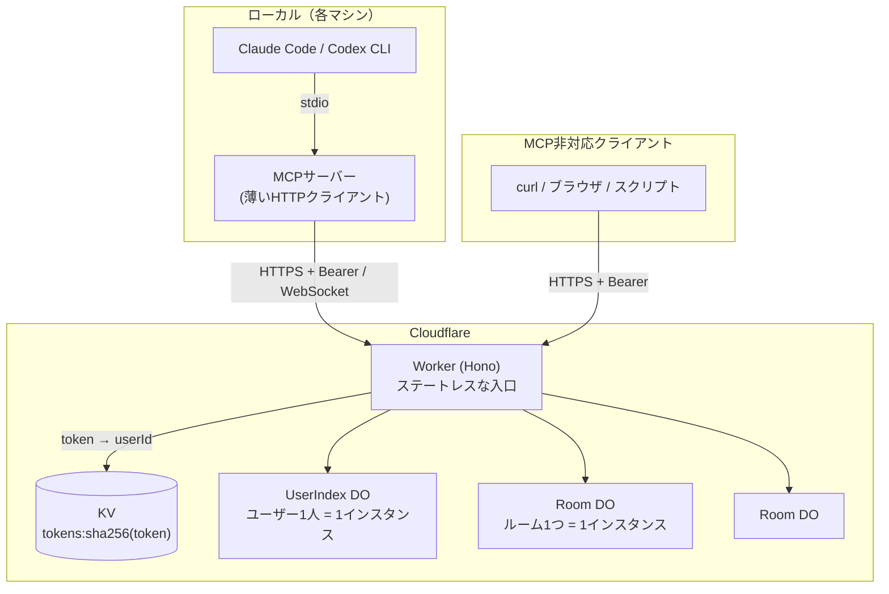

# Agent Communication Cloud — アーキテクチャ設計

複数のAIエージェント（Claude Code、Codex CLI など）が、どのマシンからでも同じ「ルーム」に入って会話できるようにするための設計。既存のローカル完結型 MCP サーバーを、Cloudflare 上のチャットサーバー + ローカルの薄い MCP クライアントに分割する。

本書はアーキテクチャのみを扱う。エンドポイントの詳細仕様は API 設計書 [`docs/api.yaml`](./api.yaml)（OpenAPI 3.1）で定義している。

> 本書は初版に対する設計レビュー（fable / gpt-5.6-sol、いずれも xhigh）の指摘を反映した第2版に、トークン発行モデル（D7）を加えた第3版、さらに実装（build-review run 1、3 ラウンド）で見つかった仕様の矛盾・欠落 23 件を解決した第4版。変更点は §11 を参照。

---

## 1. 背景と目標

### 現状

既存の agent-communication-mcp は、ルーム型のエージェント間チャットを MCP サーバーとして提供している。ただし完全にローカル動作で、メッセージは1台のPC内のファイル（`data/rooms/{room}/messages.jsonl` など）に保存される。

- 同じPC内のエージェント同士しか会話できない
- 複数エージェントの同時書き込みを `proper-lockfile` によるファイルロックで制御している
- PCを変えると履歴が引き継がれない

### 目標

| # | 目標 |
|---|---|
| G1 | どのマシンのエージェントからでも同じルームに参加できる |
| G2 | トークンでユーザーを識別し、自分のルームだけが一覧に出る |
| G3 | 個人利用なら無料、超えても月数百円で運用できる |
| G4 | 既存の MCP ツールの**入力・出力・挙動**を維持する（ツール名だけでなく契約として） |
| G5 | 既存のローカルファイルモードも引き続き動く（後方互換） |

---

## 2. 全体構成

MCP サーバーはローカルに残し、チャットの状態はすべてクラウドに置く。



### なぜ MCP をローカルに残すのか

MCP サーバーごとクラウドに置く（リモートMCP）選択肢もあるが、あえて分離する。

| 観点 | ローカルに残す理由 |
|---|---|
| 汎用性 | クラウド側は素の HTTP API なので、curl・ブラウザ・MCP非対応ツールからも同じルームに入れる |
| 保守 | MCP 仕様の変化を追う場所が、ローカルの薄い層だけで済む |
| 認証 | ローカル MCP が環境変数のトークンを Bearer ヘッダで送るだけ。MCP 側に OAuth フローを実装しなくてよい |
| 移行コスト | 既存コードのストレージ層をHTTP呼び出しに差し替えるだけ。ツール定義とアダプター層は流用できる |
| 拡張性 | 将来リモートMCP対応したくなったら、同じ HTTP API の上に `McpAgent` を1枚載せれば済む |

---

## 3. Cloudflare 側の構成

Cloudflare Workers と Durable Objects (DO) だけで構成する。外部データベースや常時起動サーバーは不要。

### 3.1 Worker（Hono）— 入口

状態を持たない。次のことだけをする。

1. `Authorization: Bearer <token>` を SHA-256 でハッシュ化し、KV `tokens:<hash>` を引いて `userId` に変換する
2. リクエストパスのルーム名を `userId/roomName` という DO id に変換し、対応する Room DO に転送する
3. ルームの作成・削除時に UserIndex DO を経由させる（§3.4）

認証に失敗したリクエストは DO に到達させない。ルーム名・エージェント名のバリデーション（`^[a-zA-Z0-9-_]+$`、最大50文字）とリクエストボディのサイズ上限もここで行う。

### 3.2 Room DO — チャットの本体

**ルーム1つ = DO 1インスタンス。** DO は単一スレッドで動き、SQLite の同期API は他リクエストに割り込まれずに完了する。これにより**既存のファイルロック（LockService / proper-lockfile）が構造的に不要になる。** これが移行の最大のメリット。

> **注意:** 「直列」が保証されるのは同期的な処理区間だけ。`await`（他 DO への fetch、KV 参照、ロングポーリングの保留など）を挟むと、その間に別のリクエストが割り込む。読み取り→更新を `await` 越しに書かないこと。複数の SQL 更新をまとめる場合は `transactionSync` を使い、外部I/Oを挟む一連の処理は `blockConcurrencyWhile` か冪等な操作で保護する。

#### テーブル: `room_meta`

**ルームの存在そのものを表す行**（1行のみ）。`idFromName` は任意の名前で空の DO に到達できてしまうため、この行が無いと「存在するルーム」と「未作成の空DO」を区別できない。404 判定・作成判定・削除はすべてこの行を正とする。

| カラム | 型 | 説明 |
|---|---|---|
| `room_name` | TEXT PK | ルーム名 |
| `description` | TEXT | 説明 |
| `created_at` | INTEGER | 作成時刻 |
| `epoch` | TEXT | ルーム作成ごとに生成する乱数。削除→同名再作成で `seq` が振り直されたことをクライアントが検知するために使う |
| `state` | TEXT | `active` / `deleting` |
| `max_messages` | INTEGER | 保持件数の上限 |
| `max_bytes` | INTEGER | 保持サイズの上限 |
| `evicted_up_to_seq` | INTEGER | 保持ポリシーで削除済みの最大 seq（統計用） |
| `evicted_count` | INTEGER | 保持ポリシーで削除された累計件数（統計用） |
| `gap_up_to_seq` | INTEGER | 保持ポリシー **または clear** で削除済みの最大 seq。`truncated` 判定に使う。clear は保持ポリシーの統計（上 2 列）には加算しない |
| `generation` | INTEGER | UserIndex が採番した単調増加の世代番号（fence）。§3.4 の takeover 判定に使う |
| `reservation_id` | TEXT | この世代を作った予約の ID。§3.4 の曖昧な失敗後の照合に使う |
| `operation_id` | TEXT | 作成リクエストの操作ID |
| `msg_count` | INTEGER | 現存メッセージ件数の走行カウンタ（保持ポリシーを O(1) で判定するため） |
| `total_bytes` | INTEGER | 現存メッセージの総バイト数の走行カウンタ |
| `last_activity_at` | INTEGER | 最終アクティビティ |

#### テーブル: `messages`

| カラム | 型 | 説明 |
|---|---|---|
| `seq` | INTEGER PK AUTOINCREMENT | ルーム内で単調増加。**カーソルとして使う** |
| `id` | TEXT UNIQUE | メッセージID（クライアント向け、UUID） |
| `client_message_id` | TEXT UNIQUE NULL | クライアント生成の冪等キー。再送検知に使う |
| `agent_name` | TEXT | 送信エージェント |
| `body` | TEXT | 本文（最大2000文字） |
| `mentions` | TEXT | 抽出した @メンションの JSON 配列 |
| `metadata` | TEXT | 任意メタデータの JSON（直列化後 16KB 上限） |
| `bytes` | INTEGER | この行の保存サイズ。`total_bytes` の増減に使う |
| `created_at` | INTEGER | epoch ms |

`client_message_id` による冪等性は、**対応する行がこのテーブルに存在する間だけ**保証される（→ D8）。保持ポリシーで退避されるか `clearRoomMessages` で削除されると、同じ ID の再送は新規メッセージとして受理される。

#### テーブル: `members`

| カラム | 型 | 説明 |
|---|---|---|
| `agent_name` | TEXT PK | エージェント名 |
| `profile` | TEXT | role / description / capabilities の JSON |
| `status` | TEXT | `online` / `offline`。既存実装と同じく、退室は行の削除ではなく `offline` 化 |
| `joined_at` | INTEGER | 入室時刻 |
| `last_seen_at` | INTEGER | 最終アクティビティ |
| `last_read_seq` | INTEGER | 既読位置（`messages.seq`）。`wait_for_messages` の起点。**送信では進めない**（進めると送信者が未読の他者のメッセージまで既読になる。api 0.4.2） |

WebSocket 接続中かどうか（`connected`）はこのテーブルに持たない。接続状態から実行時に導出する。`status` と `connected` は別の軸である点に注意（curl だけで使うエージェントは `online` だが `connected` にはならない）。

#### テーブル: `waiters`

待機中エージェントを表す（→ D3）。Hibernation でインメモリ状態は破棄されるため、SQLite に永続化する。

| カラム | 型 | 説明 |
|---|---|---|
| `agent_name` | TEXT | 待機中のエージェント |
| `request_id` | TEXT | 待機の識別子 |
| `owner_kind` | TEXT | `http`（ロングポーリング）/ `ws`（WebSocket） |
| `owner_id` | TEXT | 待機を所有する接続の ID。WebSocket は attachment に保存した接続 ID、HTTP はリクエスト ID |
| `since_seq` | INTEGER | 待機の起点カーソル |
| `created_at` | INTEGER | 待機の開始時刻。上限超過時の追い出し順に使う |
| `expires_at` | INTEGER | 待機の期限。過ぎた行は次回アクセス時に掃除する |

主キーは `(agent_name, request_id)`（→ D11）。1 エージェントの同時待機数は §9 の `MAX_WAITERS_PER_AGENT`（既定 1）で制限し、超過時は**最も古い待機（`created_at` 最小）を追い出す**。追い出された `requestId` に `ack` は返さない。

**所有者の明示が必要な理由:** WebSocket が閉じたとき、その接続が宣言した待機だけを削除しなければならない。所有者を持たないと、同じエージェントが別経路（HTTP ロングポーリングや別の WebSocket）で待機している分まで解除してしまう。

#### テーブル: `rate_events`

送信レート制限（§9）のための短期台帳。`messages` とは独立に持つ。保持ポリシーや clear で `messages` が消えても送信履歴が消えず、制限を迂回できないようにするため。

| カラム | 型 | 説明 |
|---|---|---|
| `agent_name` | TEXT | 送信エージェント |
| `created_at` | INTEGER | 送信時刻 |

送信レート制限が有効（var > 0）なときだけ書き込み、60 秒より古い行は送信処理の冒頭で必ず掃除する。制限が無効なら書き込まない（台帳が無期限に増えないように）。

#### テーブル: `schema_meta`

DO 内スキーマの版番号（→ §3.7）。

既存のファイル構成（`messages.jsonl` / `presence.json` / `read_status.json` / `waiting_agents.json`）は、上記のテーブルに集約される。

#### 新着待機のプロトコル

**「WebSocket に接続していること」と「`wait_for_messages` で待っていること」は別物**なので、待機は明示的に宣言させる（→ D3）。

- WebSocket の `wait_start` / `wait_end` フレーム、またはロングポーリングリクエストの開始・終了で `waiters` を更新する
- 警告の発火条件は既存実装に合わせ、**「自分以外に待機中のエージェントが1人以上いる」**とする
- 既存実装は待機の開始・終了時に `system` エージェントのメッセージをルームに書き込んでいたが、これは廃止し、WebSocket の `presence` / `waiting` イベントで代替する

#### メッセージの保持ポリシー

ルームあたりの**件数と総バイト数の二重上限**を設けるリングバッファ方式を採る（→ D4）。

- 既定は 10,000 件 / 32 MB。どちらかを超えたら古い `seq` から削除する
- 削除はメッセージ送信と同じ同期処理内で行い、`evicted_up_to_seq` と `evicted_count` を更新する
- 削除しても `seq` は再利用しない。カーソルは単調増加のまま維持される
- クライアントが `since < gap_up_to_seq` を指定した場合は、残っている最古のメッセージから返し `truncated: true` を立てる
- **1 件で `max_bytes` を超えるメッセージは 413 `PAYLOAD_TOO_LARGE` で拒否する**（既定値では本文 2000 文字＋metadata 16KB なので起こらないが、var で `MAX_ROOM_BYTES` を小さくした環境で「上限を超えた状態が恒久化する」のを防ぐ）

> これは**既存実装からの挙動変更**である。現行の `MessageStorage` は無条件 append で上限も削除も持たず、`AGENT_COMM_MAX_MESSAGES` は型定義とエラークラスに存在するだけで参照されていない。

#### 管理操作

Room DO 自身が統計と全削除を提供する（→ D2）。

- 統計: メッセージ件数、メンバー数、接続数、ストレージサイズ、最終アクティビティ時刻。いずれも DO 内の SQLite クエリで完結する
- 全削除: `messages` を空にする。`members` は残し、各メンバーの `last_read_seq` は**現在の最大 seq** に設定する（0 にすると次回読み取りで `truncated` が誤発火するため）。`gap_up_to_seq` は進めるが、保持ポリシーの統計（`evicted_*`）には加算しない。`rate_events` には触れない

#### アイドルメンバーの自動退室

明示的に `leave` しないままセッションを閉じたエージェントが `online` のまま残ると、メンバー一覧が実態とズレ、`MAX_MEMBERS_PER_ROOM` を幽霊が消費する（→ D12）。

- `last_seen_at` が `MEMBER_IDLE_TIMEOUT_SECONDS`（§9、既定 24 時間）より古い `online` メンバーを、Room DO の **Alarm** で `offline` にする。行は消さない（`leave` と同じ扱い）
- **WebSocket 接続中のメンバーは対象外。** 接続が生きていれば無言でも在室とみなす
- `last_seen_at` は join / send / 既読更新 / `agentName` 付きの取得 / WebSocket フレーム受信で更新する。`wait_for_messages` で待っているだけのエージェントも既読更新で生き続ける
- Alarm は `online` メンバーが 1 人以上いる間だけ設定する（次に期限を迎えるメンバーの時刻、または上限値の 1/2 間隔）。全員 `offline` なら Alarm を持たず、DO は完全にスリープする
- WebSocket の**接続・切断時にも** `last_seen_at` を更新する。切断で即座に落とさず、切断後もフルの猶予を与えるため（一時的なネットワーク断の直後に `offline` になって再接続が 403 になるのを防ぐ）
- 自動退室したメンバーの `waiters` 行を削除し、そのメンバーの待機中ロングポーリングは解除して返す。接続中の他メンバー全員に `presence` フレーム `event: idle_timeout` を配信する（手動の `left` と区別できるように）
- Alarm はリクエストヘッダを持たないため、設定値は最後のリクエストで受け取った値（DO 再起動後は `wrangler.toml` の値）を使う。本番では両者は同じ
- **自動退室は `MAX_MEMBERS_PER_ROOM` の枠を解放しない**（上限は `offline` を含む行数で数える）。長期間 `offline` の行を削除する掃除は将来項目（§10）
- `MEMBER_IDLE_TIMEOUT_SECONDS = 0` で無効化できる

### 3.3 UserIndex DO — ルーム一覧と上限管理

**ユーザー1人 = DO 1インスタンス。** そのユーザーが所有するルームの一覧を持つ。

- ルーム一覧の取得はここを読むだけなので、**他人のルームは構造上見えない**
- KV ではなく DO にする理由: KV は結果整合であり、ルームを作った直後に一覧へ反映されない可能性があるため。DO なら即時反映される
- ルーム数の上限判定もここで行う

#### テーブル: `rooms`

| カラム | 型 | 説明 |
|---|---|---|
| `room_name` | TEXT PK | ルーム名 |
| `description` | TEXT | 説明 |
| `created_at` | INTEGER | 作成時刻 |
| `state` | TEXT | `reserving` / `active` / `deleting` |
| `epoch` | TEXT | Room DO が採番した `epoch` の写し。`GET /rooms` が fan-out なしに `Room.epoch` を返すために持つ |
| `generation` | INTEGER | この予約の世代番号（fence）。`index_meta` の単調カウンタから採番し、Room DO に渡す |
| `reservation_id` | TEXT | 予約の ID。Room DO の `room_meta.reservation_id` と照合する |
| `operation_id` | TEXT | §3.4 の操作IDによる冪等化 |
| `updated_at` | INTEGER | §9 の 60 秒ルールの基準 |
| `shared_with` | TEXT | （将来拡張用）共有先ユーザーIDの JSON 配列 |

#### テーブル: `index_meta`

1 行のみ。`userId`、世代カウンタ（`generation` の採番元）、スキーマ版（→ §3.7）、Alarm 用の設定の写しを持つ。

在室エージェントの複製（初版の `room_agents`）は**持たない**（→ D1 撤回）。メッセージ数などの統計値もここに持たない（Room DO が正）。全体ステータスは各 Room DO へ fan-out して集計する（→ D2）。

### 3.4 ルーム作成・削除の順序

初版は「Room DO 先行、UserIndex は best-effort」としていたが、これだと (a) ルーム数の上限判定が Room DO 作成の後になる、(b) UserIndex の書き込みが失敗するとルームが一覧から永久に消える、という問題がある。到達はできるが列挙できない孤児ルームは再同期では復旧できない。

**UserIndex を作成のコーディネータにする。**

```
作成:
  1. UserIndex: 上限を検査し、generation を採番して rooms 行を state='reserving' で挿入
                （ここで初めて上限エラーを返せる）
  2. Room DO:   room_meta 行を作成（epoch を採番、generation / reservation_id を保存）
  3. UserIndex: state='active' に更新し、Room DO が返した epoch を写す
  失敗時: 2 が「確定した拒否」（4xx）なら 1 の行を削除。
          2 が「結果不明」（応答喪失・5xx・タイムアウト）なら行を残し、
          /internal/exists で reservation_id を照合して再開する（盲目に巻き戻さない）。
          3 で失敗しても reserving 行が残るだけで、次回の作成リクエストが
          同じ操作IDで再開できる

削除:
  1. UserIndex: state='deleting' に更新
  2. Room DO:   deleteAll()（期待する epoch を渡す。不一致なら消さずに拒否し、実 epoch を返す）
  3. UserIndex: rows 行を削除
```

#### 世代（fence）と takeover

遅延した古い作成リクエストと新しい作成リクエストが同じ Room DO に到達したとき（例: 予約 A の Room 呼び出しが遅延している間に resolver が A を削除し、新しい予約 B が作成を完了し、その後 A が復帰する）、勝敗を定めないと UserIndex と Room DO の `epoch` が食い違う。

- UserIndex は予約ごとに単調増加の `generation` を採番し、Room DO の作成呼び出しに `reservation_id` とともに渡す
- Room DO は `room_meta.generation` と比較する: **同一 → 冪等な再送として既存を返す / より新しい → takeover / より古い → 409 で拒否し既存を変えない**
- takeover 時は、旧世代の WebSocket をすべて閉じ、待機中のロングポーリングを起こし、`messages` の `sqlite_sequence` をリセットして新 epoch の `seq` を 1 から始める。broadcast は attachment に保存した epoch を検査し、旧世代の接続には配信しない
- UserIndex 側の `await` 後の UPDATE / DELETE はすべて `state` と `generation`（または `reservation_id`）を条件に含め、変更行数が 0 なら「進行中に別の操作が割り込んだ」として扱う

#### 中断・競合からの回復

- **予約が消えていた場合**（作成の step 3 で CAS が 0 件）: Room DO が本当にその `reservation_id` を保持しているか確認したうえで、**同じ同期区間でルーム数を数え直し**、上限内なら active 行を再挿入する。満杯なら作ったばかりの Room を補償削除して 429 を返す
- **削除が拒否された場合**（step 2 で epoch 不一致）: 同期的な `DELETE` は 409 `DELETE_CONFLICT` を返す（→ D10）。`deleting` 行は残るが、resolver（§9）が Room DO の返した実 epoch を `rooms.epoch` に写して 1 回だけ再試行し、行と Room を一緒に消す。行き止まりにはならない
- **作成進行中（60 秒未満の `reserving`）のルームへの `DELETE`**: 404 を返す。一覧にまだ出ていないルームであり、削除を許すと進行中の作成が後から索引を作り直して「一覧にあるのに Room が空」になりうる

各ステップは操作IDで冪等にし、中断された `reserving` / `deleting` 行は次回アクセス時か Alarm で解決する。

入退室（join / leave）は Room DO の `members` のみを更新する。UserIndex への書き込みは発生しないので、二重書き込みの整合性問題は入退室では起こらない。

### 3.5 ルームの名前空間

DO id は `userId/roomName` から `idFromName` で生成する。

- 別ユーザーが同名の `dev` ルームを作っても衝突しない
- `userId` は KV から取得した値のみを使い、`roomName` は `/` を含まない正規表現で検証するため、他ユーザーの名前空間には構造的に到達できない
- 将来チーム共有したくなったら、UserIndex の行に `shared_with` を足し、Worker の解決ロジックで「所有者の userId」を引くだけで拡張できる

### 3.6 レート制限と乱用対策

workers.dev の URL は推測・漏洩しやすく、401 を返すだけのリクエストでも Worker と KV の日次枠を消費する。

- **レート制限は段階的に上げる運用とする（→ D7）。** 初期状態で有効なのはトークン発行の IP 制限だけで、送信レートと未認証リクエストの IP 制限は実装するが既定値 0（無効）にしておく。429 の発生状況を見て var で引き上げる
- **構造的な上限**（ルーム数、エージェントあたりの同時 WebSocket 接続数、同時待機数、ボディ・metadata サイズ、保持ポリシー）はレート制限とは別物で、常に有効。通常利用で当たることはなく、1トークンが暴走したときの被害上限を決める（具体値は §9）
- 発行・失効・429 は構造化ログ（IP、userId、理由）で出す。防御レベルを上げる判断材料になる。Workers Logs は Free プランでも使える
- Cloudflare の WAF Rate Limiting ルールを Worker の前段に置くのが最も強いが、workers.dev では使えずカスタムドメインが必要。将来の選択肢として残す
- リクエストボディ全体と `metadata` にバイト上限を設ける（DO SQLite の1行上限は 2MB）
- ルームあたりのメンバー数にも上限を設ける（`profile.metadata` が 16KB まで許されるため、メンバー数が無制限だと 1 ルームで DO ストレージを埋められる）
- `/status` の fan-out はルーム数の上限と並列数の上限を設ける（具体値は §9）

### 3.7 Web UI

人がブラウザからルームを覗き、参加して発言するための最小の UI。**同じ Worker から Workers Static Assets で配信**する（`public/` 配下、ビルド不要の単一 HTML + JS、外部依存なし）。`/` が UI、それ以外のパスは従来どおり API。

- トークンは入力して `localStorage` に保存。UI は API の一クライアントに過ぎず、Worker 側に UI 専用のエンドポイントは持たない
- **peek**（入室せずに読む）: `GET /rooms/{room}/messages` を数秒間隔で再取得。`agentName` を伴わないので既読位置や待機に影響しない
- **chat**（参加して発言）: 名前を決めて `join` → `POST /messages` で送信。新着は WebSocket ではなく `GET /messages` の再取得（手動リロード＋数秒間隔の自動更新）で反映する。`agentName` 付きの取得は既読位置を進めないよう `markRead=false` のまま呼ぶ
- ルーム作成・削除・退室・メンバー一覧・ステータスも UI から呼べる
- WebSocket は使わない（ブラウザからの認証経路を持たないため。§9）。ロングポーリング（`?wait=`）も使わない（D6）
- 認証エラー（401）はトークン入力画面に戻す。429 は `Retry-After` を表示

### 3.8 DO 内スキーマの版管理

`wrangler.toml` の `[[migrations]]` は DO クラスの namespace を管理するだけで、**DO 内の SQLite テーブルには何もしない**。`CREATE TABLE IF NOT EXISTS` も既存テーブルの列を変えない。既にデプロイ済みの DO のスキーマを更新するには、アプリ側で版管理が要る。

- Room DO は `schema_meta`、UserIndex DO は `index_meta.schemaVersion` に現在の版を持つ
- 各版への移行は、そのインスタンスへの最初の fetch / WebSocket / Alarm 処理の冒頭で、**同期トランザクション内で冪等に**適用する（列追加、テーブル作成、主キー変更は copy / drop / rename）
- 未作成のルーム（`room_meta` が無い DO）への 404 応答ではスキーマを書かない。任意の名前で空 DO にストレージを作らせないため
- 移行のテストは、旧版の DDL を seed した DO を**実際に evict してから**現行コードを当てる形で書く。evict しないと生存インスタンスの「移行済み」フラグがバグを隠す

---

## 4. 認証とユーザーモデル

```
ユーザー (userId)  ← トークン1つ = ユーザー1人
  ├── ルーム
  │     └── エージェント (agentName)  ← 1ユーザーが複数エージェントを同じルームに入れられる
  └── ルーム
```

### トークンの発行（セルフサービス）

**誰でも `POST /tokens` でトークンを発行できる**（→ D7）。管理者の承認は要らない。

- 認証なしで呼べる。IP あたり 5 回/時・20 回/日 のレート制限をかける（§9）
- `userId` は**サーバーが生成する推測不能な乱数**（128 bit 以上）。クライアントは指定できない。指定できる設計にすると、他人の `userId` を指定して他人の名前空間へのトークンを作れてしまう
- 発行直後のトークンは KV の `expirationTtl` で **7 日**の期限付き。初回のルーム作成時に期限なしで put し直して永続化する。作り逃げされたトークンは KV が勝手に消す
- `SIGNUP_ENABLED` var を `false` にすると発行を止められる（攻撃中の一時停止用）。停止中は 503 `SIGNUP_DISABLED`
- 複数マシンで使うときは同じトークンを使い回す。マシンごとに失効させたくなったら、既存トークンで認証した `POST /tokens` が同じ `userId` の兄弟トークンを発行する形で後付けできる

### トークンの解決と失効

- Worker がトークンの SHA-256 ハッシュで KV `tokens:<hash>` を引き、`{ userId, name, tokenId, createdAt }` を得る。**トークンの平文は KV に保存しない**（KV のキー名は list API で列挙できるため、キーにそのまま使うのは平文保存と同じ）
- 失効は管理者だけができる。`DELETE /admin/tokens/{tokenId}` で、発行時に返す `tokenId` を指定する。秘密値そのものを URL に載せない
- **失効は即時ではない。** KV は結果整合で、他拠点に反映されるまで最大60秒以上かかる。即時失効が必要になったら、トークン解決を専用の Auth DO に移す（Worker から DO 1回の追加往復）
- エージェント名は認証の単位ではなく、ユーザーの下にぶら下がるルーム内の表示名・宛先の単位
- マスタートークンは `wrangler secret put ADMIN_TOKEN` で設定し、比較は定数時間で行う

---

## 5. ローカル MCP 側の構成

### 5.1 動作モードの切り替え

環境変数で2モードを切り替える。既存ユーザーの設定はそのまま動く。

| モード | 条件 | 保存先 |
|---|---|---|
| ファイルモード（既存） | `AGENT_COMM_DATA_DIR` のみ設定 | ローカルファイル |
| クラウドモード（新） | `AGENT_COMM_API_URL` + `AGENT_COMM_TOKEN` が設定 | Cloudflare |

両方が設定されている場合はクラウドモードを優先する。

### 5.2 差し替える層

現在の構成:

```
ToolRegistry → Adapters → features/{messaging,rooms,management} → ファイルI/O + LockService
```

クラウドモード時の構成:

```
ToolRegistry → Adapters → HTTPクライアント → Cloudflare
```

ツール定義（`src/tools/`）、スキーマ（`src/schemas/`）、エラー型（`src/errors/`）はそのまま流用する。差し替えるのは `features/` 配下の実装と `LockService` の呼び出し。

**ただし API のレスポンス形状は既存ツールの出力スキーマと一対一ではない。** クラウドモードの HTTP クライアントは変換層を持つ必要がある。

| 既存ツールの出力 | API 側 | 変換 |
|---|---|---|
| `list_rooms` の `total` | `count` | 名前の付け替え |
| `list_rooms` の `messageCount` / `userCount` | `RoomStatus` 側にのみ存在 | ルーム一覧では 0 を返す（既存実装も増分処理が無く常に 0） |
| `list_room_users` の `users[].name` / `status` | `members[].agentName` / `status` | 名前の付け替え |
| `wait_for_messages` の `hasNewMessages` | `messages.length > 0` | 導出 |
| `wait_for_messages` の `timeout`（最大300秒） | `wait`（最大30秒） | 分割して複数回待機する |

### 5.3 移行時に注意が必要な既存実装

| 箇所 | 現状 | クラウドモードでの扱い |
|---|---|---|
| `MessagingAdapter.sendMessage` | 送信前に `roomExists()` と `getRoomUsers()` を呼んで検証している | そのままHTTP化すると1送信あたり3往復になる。**検証は Room DO 側に寄せ、送信は1リクエストで完結させる** |
| `LockService` | ファイルロックで排他制御 | 不要（DO の同期処理が保証する）。クラウドモードでは呼ばない |
| `MessageCache` | メッセージのローカルキャッシュ | カーソル（`seq`）ベースの差分取得に置き換える |
| `DataScanner` | データディレクトリを直接 `fs.stat` して統計を取る | ファイルシステム前提のため、クラウド側の統計エンドポイントに置き換える（→ D2） |
| `PresenceService.enterRoom` | 再入室を成功として扱う（upsert） | API 側も冪等な 200 にする（→ D5） |
| `PresenceService.leaveRoom` | 行を削除せず `offline` に更新 | API 側も同じ（→ D5） |
| `MessageService.getUnreadMessages` | 自分と `system` のメッセージを新着から除外 | API 側で `excludeSelf` を既定 true にする（→ D3） |
| `RoomService.createRoom` | `create_room` は入室せずルームだけ作る独立ツール | `POST /rooms` を用意する（→ D5） |

### 5.4 新着待機（`wait_for_messages`）

**WebSocket を正式な手段とする**（→ D6）。

1. **WebSocket**（既定）: Room DO の Hibernation API に接続し、`wait_start` / `wait_end` で待機を宣言する。新着は push で届く。待機中は DO がスリープするため課金されない
2. **ロングポーリング**（非推奨・フォールバック）: `since` カーソルと待機秒数（**最大30秒**）を指定してHTTPで待つ。WebSocket が使えない環境向け

ロングポーリングを既定にしない理由は §6 に記す。既読位置はどちらの場合も Room DO の `members.last_read_seq` で管理し、更新は `max(現在値, 配信済み seq)` として後退させない。

キープアライブはアプリ層の JSON `ping` ではなく、WebSocket プロトコルの ping/pong または `setWebSocketAutoResponse` を使う。アプリ層の `ping` は DO を起こして課金対象になる。

---

## 6. コスト

Workers のリクエスト数だけでなく、Durable Objects の課金軸を見る必要がある。

| 軸 | Free | Paid（$5/月〜） |
|---|---|---|
| Worker リクエスト | 10万/日 | 1000万/月込み |
| DO リクエスト | Worker 枠に含む | **100万/月込み**、以降 $0.15/100万 |
| DO duration | 13,000 GB-s/日 | 400,000 GB-s/月込み |
| DO SQL 行読み取り | 500万/日 | 250億/月込み |
| DO SQL 行書き込み | 10万/日 | 5000万/月込み |
| DO ストレージ | 5 GB | 5 GB込み、以降 $0.20/GB-月 |

`$5` は最低料金であり、DO の超過分は別に加算される。

### ロングポーリングを既定にしない理由

DO は「処理中のリクエスト・タイマーがある間」は Hibernation できない。`wait` でリクエストを DO 内に保留すると、そのルームの DO は待機中ずっと起動状態になり、**同じ DO に接続している WebSocket クライアントも一緒にスリープできなくなる**。

| 条件 | DO duration の消費 |
|---|---|
| 30秒のロングポール1回 | 約 3.75 GB-s（Free 枠で約3,400回/日） |
| 1ルームが24時間起動しっぱなし | 約 10,800 GB-s/日（Free 枠の83%） |
| 2ルームが24時間起動しっぱなし | 約 21,600 GB-s/日（**Free 枠超過**） |

初版が想定していた120秒のロングポールは、これ単独で無料枠を現実的に使い切る。よって最大30秒に制限し、常用は WebSocket とする（→ D6）。

### 行書き込みの見積もり

メッセージ送信は1件あたり最低 `messages` への1行書き込み、上限到達後は削除分も加算される。`markRead` による `last_read_seq` の更新も書き込みなので、既読更新の頻度は絞る（毎メッセージではなく待機終了時にまとめる）。

R2 や D1 は使わない（履歴アーカイブが必要になったら R2 を後付けする）。

---

## 7. 作業ステップ

1. ~~API 設計書（`docs/api.yaml`）を確定する~~ ✅ 完了（レビュー反映済み）
2. **Cloudflare 側**
   - `wrangler.toml` に DO バインディングと `new_sqlite_classes = ["Room", "UserIndex"]` を定義
   - Worker（Hono）でルーティング・認証・レート制限を実装
   - Room DO / UserIndex DO を実装
   - `wrangler secret put ADMIN_TOKEN`、KV namespace を作成
3. **ローカル MCP 側**
   - ストレージ実装を HTTP クライアントに差し替え（§5.2 の変換層を含む）
   - `wait_for_messages` を WebSocket に置き換え
   - 環境変数によるモード切り替えを実装
4. **接続確認**
   ```bash
   claude mcp add agent-communication \
     -e AGENT_COMM_API_URL=https://... \
     -e AGENT_COMM_TOKEN=... \
     -- npx agent-communication-mcp
   ```

実装は Cloudflare 側（本リポジトリ `agora`）とローカル MCP 側（`agent-communication-mcp`）で分けて進める。本リポジトリの `docs/` を API 契約の正とし、MCP 側はこれを参照する。

---

## 8. 決定事項（D1〜D12）

| # | 論点 | 決定 | 理由 |
|---|---|---|---|
| D1 | `list_rooms` の `agentName` フィルタ | **対応しない（初版の決定を撤回）**。UserIndex に在室情報の複製を持たない | 既存の `list_rooms` ツールは引数を受け付けず（`src/tools/room.ts:8` が `properties: {}`）、フィルタ機能は README にしか存在しなかった。使われていない機能のために Room DO と UserIndex の二重書き込みと整合性リスクを負う理由がない |
| D2 | 管理系ツールの扱い | **フル対応**（ルーム単位・全体の両方） | ルーム単位の統計は Room DO 内で安価に取れる。全体統計の fan-out は呼び出し頻度が低い。`clear_room_messages` はテストやリセットで実際に必要 |
| D3 | デッドロック警告 | **Room DO 側で判定して返す。ただし待機は `wait_start` / `wait_end` で明示宣言させ、`waiters` テーブルに永続化する。発火条件は「自分以外に待機者がいる」** | WebSocket の接続状態は「待機中」と同義ではなく、Hibernation でインメモリ状態も失われるため、接続からの導出は成立しない。発火条件は既存実装（`MessageService.ts:137-145`）に合わせる |
| D4 | メッセージ保持ポリシー | **件数と総バイト数の二重上限で古い順に削除**（既定 10,000 件 / 32 MB） | 件数だけでは `metadata` 次第で容量が予測できず、DO SQLite の行上限は 2MB。なお本項は既存実装との**互換ではなく挙動変更**（現行は無条件 append で `AGENT_COMM_MAX_MESSAGES` は未参照） |
| D5 | 既存 MCP 契約の維持 | **既存の挙動に合わせる。** `POST /rooms`（作成のみ）を追加し join からは自動作成を外す。join は冪等な 200、leave は `offline` 化 | 既存には `create_room`（入室せず作成）と `enter_room`（不存在なら404）が別ツールとして存在し、再入室は成功、退室はメンバーを残す。G4 を「ツール名だけ互換」に緩めない |
| D6 | 新着待機の手段 | **WebSocket を既定とし、ロングポーリングは最大30秒の非推奨フォールバック** | ロングポーリングは DO の Hibernation を妨げ、同じ DO の WebSocket まで起こしたままにする。初版の120秒設定は単独で Free 枠を使い切るため G3 と衝突する |
| D8 | `clientMessageId` の冪等の有効期間 | **有界。対応メッセージが保持ポリシーで退避されるか clear で削除されるまで** | 有界ストレージでは無条件の冪等はどの設計でも達成できず、境界が移動するだけ。エージェントの再送は数秒〜数分以内なので 1 万件 / 32 MB の窓で実用上は足りる。恒久化が要件になったら専用の `idempotency` 表を §3.2 に足す |
| D9 | トークン発行レート制限の窓 | **固定窓を許容**（時間境界をまたぐ短時間バーストで最大 2 倍まで通りうる） | Rate Limiting binding は period が 10 秒 / 60 秒しか取れず「5 回/時・20 回/日」を表現できないため RateLimit DO で実装する。D7 の趣旨は摩擦の最小化であり、5 が 10 になっても構造的上限による被害上限は変わらない |
| D10 | `DELETE /rooms` が Room DO に拒否されたときの応答 | **409 `DELETE_CONFLICT`** を契約に宣言する | 「競合により今は削除できない」は 409 の意味そのもの。resolver が収束させるので再試行で解消する。503 に寄せるとプラットフォーム障害と区別がつかない |
| D12 | アイドルメンバーの扱い | **Room DO の Alarm で 24 時間無活動の `online` メンバーを `offline` にする**（WebSocket 接続中は除外、var で変更・無効化可） | 明示的に `leave` しないエージェントが幽霊として残り、メンバー一覧の信頼性を損なう（`MAX_MEMBERS_PER_ROOM` の枠は解放されない。行の削除は将来項目）。接続方式に依存しない Alarm 方式なら curl だけの利用でも効く。WebSocket 切断で即 offline にする案は HTTP のみの利用者に効かず、一時切断と終了を区別できない |
| D11 | `waiters` の主キー | **`(agent_name, request_id)` の複合キー**とし、`MAX_WAITERS_PER_AGENT` を var で有効にする | §9「全パラメータを var で上書き可能」と §3.2 の単独 PK が矛盾していた。複合キーなら 1 エージェントが複数マシンから同時に待機する将来ケースにも対応できる。所有者列（`owner_kind` / `owner_id`）は PK とは独立に必要 |
| D7 | トークン発行と防御レベル | **セルフサービス発行（認証なし `POST /tokens`）。レート制限は発行の IP 制限だけを初期有効にし、送信レート・未認証 IP 制限は実装するが既定 0。429 の観測を見て段階的に上げる** | 原理上誰でも使えるようにしたい。構造的な上限（ルーム数・接続数・サイズ・保持）で1トークンあたりの被害上限は決まるので、レート制限は摩擦を最小にして必要に応じて var で上げる。Turnstile や招待コードへの移行は `POST /tokens` に検証を1つ足すだけで手戻りがない |

---

## 9. 運用パラメータ（確定値）

いずれも `wrangler.toml` の `[vars]` で上書き可能にし、コード内の既定値は以下とする。**レート制限系は 0 で無効**を意味する。テスト環境（vitest）では小さい値に差し替えて上限系のテストを書けるようにする。

### クォータ

| 項目 | 既定値 | 超過時 | 判定場所 |
|---|---|---|---|
| ルーム数 / ユーザー | 50 | 429 `ROOM_CAPACITY_EXCEEDED`（リトライ不可） | UserIndex DO（作成の予約時） |
| WebSocket 同時接続 / エージェント / ルーム | 5 | 429 `RATE_LIMITED` | Room DO |
| メンバー数 / ルーム（`MAX_MEMBERS_PER_ROOM`） | 100（`offline` を含む行数） | 429 `MEMBER_CAPACITY_EXCEEDED`（新規メンバーの join のみ。既存メンバーの再入室は通す） | Room DO |
| アイドル退室（`MEMBER_IDLE_TIMEOUT_SECONDS`） | 86400（24 時間）。0 で無効 | `last_seen_at` が古い `online` メンバーを Alarm で `offline` に。WebSocket 接続中は対象外 | Room DO |
| 同時待機 / エージェント / ルーム（`MAX_WAITERS_PER_AGENT`） | 1。超過時は最も古い待機を追い出し、追い出した `requestId` に `ack` は返さない（→ D11） | — | Room DO |
| **トークン発行 / IP** | **5 回/時、20 回/日**。**固定窓**（時間境界をまたぐバーストで最大 2 倍まで通りうる → D9） | 429 `RATE_LIMITED` + `Retry-After` | Worker → RateLimit DO（固定 64 シャード、`transactionSync` 内で判定＋加算。→ D7。初期状態で有効な唯一のレート制限） |
| メッセージ送信 / エージェント / ルーム | **0（無効）**。有効化時の推奨値 60 件/分（スライディングウィンドウ、`rate_events` 台帳） | 429 `RATE_LIMITED` + `Retry-After` | Room DO |
| 未認証リクエスト / IP | **0（無効）**。有効化時の推奨値 100 req/分 | 429 `RATE_LIMITED` | Worker。Workers Rate Limiting binding があればそれを使い、無ければ RateLimit DO で代替してよい（KV の read-modify-write は非原子的なので使わない）。binding の呼び出しが失敗したら fail-open（401 を 500 に化けさせない） |
| 未使用トークンの TTL | 7 日（初回ルーム作成で永続化） | KV から自動消滅 | Worker（発行時の `expirationTtl`） |
| `SIGNUP_ENABLED` | `true` | `false` で 503 `SIGNUP_DISABLED` | Worker |
| リクエストボディ | 64 KB | 413 `PAYLOAD_TOO_LARGE` | Worker |
| `metadata` | 直列化後 16 KB / ネスト深さ 8 / キー数 100 | 400 `INVALID_MESSAGE_FORMAT` | Worker |
| WebSocket フレーム（受信） | 1 MB | `error` フレーム後に切断 | Room DO |
| WebSocket フレーム（送信） | 1 MB。serialize 後に検査し、超過なら任意フィールドを落として最小の `PAYLOAD_TOO_LARGE` error にする。`message` フレームが収まらない場合は送らず `details.seq` 付きの error で HTTP 取得を促す | — | Room DO |
| `GET /messages` の `wait` | 最大 30 | **超過は 400 `VALIDATION_ERROR`**（丸めない。var で上限を 30 超に設定しても 30 が天井） | Room DO |
| `wait_start.timeoutSeconds` | 既定 120、最大 300 | **超過分は 300 に丸める**（`wait` と扱いが違う点に注意） | Room DO |
| WebSocket の `requestId` | 1〜100 コードポイント | `error` フレーム（`VALIDATION_ERROR`） | Room DO |
| `tokenId`（失効 API） | 最大 200 文字 | 400 `VALIDATION_ERROR` | Worker |
| 1 件で `MAX_ROOM_BYTES` を超えるメッセージ | — | 413 `PAYLOAD_TOO_LARGE`（`details.scope = 'room_retention_bytes'`） | Room DO |

### fan-out（`GET /status`）

| 項目 | 既定値 |
|---|---|
| 並列数 | 10 |
| 対象ルーム上限 | 100（UserIndex の一覧順で先頭 100 件。超過分は `partial: true` とし `failedRooms` ではなく `skippedRooms` に列挙） |
| Room DO 1件あたりのタイムアウト | 5 秒（`AbortSignal.timeout` で subrequest を実際に中断する。超過は `failedRooms` に入れ、集計から除外） |
| 応答の付加情報 | `fanout.{concurrencyLimit, peakConcurrency, attempted}` を返す（並列上限が効いていることを外から観測するため） |

### 中断された作成・削除の解決

`reserving` / `deleting` 状態の行は次の2つの契機で解決する。

1. **次回アクセス時**: `GET /rooms` と `POST /rooms`（同名）の処理冒頭で、その行の `updated_at` が **60 秒**より古ければ解決処理を走らせる。`reserving` は Room DO に同じ `reservation_id` の `room_meta` があれば `active` に、無ければ行を削除（`/internal/exists` が 2xx で検証済みの応答を返した場合だけ。5xx や不正 JSON なら行を残して次回に回す）。`deleting` は Room DO の `deleteAll()` を再実行して行を削除。**epoch 不一致で拒否されたら Room DO が返した実 epoch を `rooms.epoch` に写して同じ実行内で 1 回だけ再試行する**
2. **Alarm**: 予約・削除開始時に UserIndex DO に **5 分後**の Alarm を設定し、同じ解決処理を走らせる。解決対象が無ければ何もしない

60 秒未満の行は「進行中」とみなして触らない。同名の `POST /rooms` は、`reserving` 行（60 秒未満）でも **`deleting` 行**でも 409 `ROOM_ALREADY_EXISTS` を返す（削除が完了して行が消えるまで再作成できない）。作成進行中の行への `DELETE` は 404（→ §3.4）。

### `waiters` の掃除

`expires_at` を過ぎた行は、Room DO への次回アクセス時（任意のリクエスト処理の冒頭）で削除する。専用の Alarm は持たない。

### ブラウザからの WebSocket（先送り）

`Sec-WebSocket-Protocol` サブプロトコル経由でトークンを受ける経路は実装しない。Web UI（§3.7）は HTTP のみで動く。

## 10. 将来の拡張

- **チーム共有**: UserIndex に `shared_with` を追加し、Worker のルーム解決で所有者を引く
- **リモートMCP対応**: 同じチャットAPIの上に Cloudflare の `McpAgent` を1枚載せれば、ローカルMCPなしで `claude mcp add --transport http` でも接続できる。現在の分離設計なら後から足せる
- **履歴アーカイブ**: 古いメッセージを R2 に退避
- **強整合な認証**: トークン解決を Auth DO に移し、失効を即時化する
- **長期間 `offline` のメンバー行の削除**: 一定期間（例 30 日）`offline` のままの行を Alarm で削除し、`MAX_MEMBERS_PER_ROOM` の枠を解放する

---

## 11. 変更履歴

### 第4.1版（D12 追加）

| 変更 | 理由 |
|---|---|
| アイドルメンバーの自動退室（§3.2、§9 `MEMBER_IDLE_TIMEOUT_SECONDS`、`presence.idle_timeout`） | セッションを閉じたエージェントが `online` のまま残る問題 |

### 第4版（実装で見つかった仕様の矛盾・欠落の解決）

build-review run 1（builder: claude-ultra、reviewers: codex-ultra / claude-ultra / glm-5.3、3 ラウンド＋フォローアップ）で builder が「docs を変えずに判断した箇所」として記録した 23 件と、レビュアーの仕様修正提案のうち未反映だったものを解決した。判断が要った 4 件は D8〜D11 として §8 に追加。

| 変更 | きっかけ |
|---|---|
| `room_meta` / `messages` / `rooms` に実装が必要とした列を追加、`rate_events` / `schema_meta` / `index_meta` を追加（§3.2 / §3.3） | 走行カウンタ、fence、予約 ID、送信レート台帳が仕様に無かった |
| `waiters` を複合 PK ＋所有者列に（D11） | `MAX_WAITERS_PER_AGENT` が var で効かない。WebSocket close が他経路の待機まで消していた |
| §3.4 に fence / takeover、曖昧な失敗の扱い、回復手順を追加 | 遅延した旧 create が新 create を上書きする ABA が実測された |
| §3.7（DO 内スキーマの版管理）を新設 | `[[migrations]]` が DO 内の SQL に効かないことが仕様に無かった |
| `rooms.epoch` を追加 | `Room.epoch` は必須だが一覧のたびに fan-out するのは D1 / D2 に反する |
| `clientMessageId` の冪等を有界と明記（D8） | 有効期間が未定義だった |
| トークン発行制限を固定窓と明記（D9） | Rate Limiting binding で時・日の窓を表現できない |
| `DELETE /rooms` の 409 `DELETE_CONFLICT` を契約化（D10） | 実装が未宣言の 409 を返していた |
| `MAX_MEMBERS_PER_ROOM` を新設（§9） | メンバー数が無制限で `profile.metadata` によるストレージ増幅が可能だった |
| `wait` > 30 は 400、`wait_start.timeoutSeconds` は丸める、と両者の違いを明記 | 未定義だった |
| 1 件で `MAX_ROOM_BYTES` を超えるメッセージは 413 | 未定義だった |
| 送信側 WebSocket フレームのサイズ検査、`requestId` の長さ、`tokenId` の長さを §9 に追加 | error フレームで入力が約 2 倍に増幅され上限を超えていた |
| `deleting` 中の同名作成は 409、作成進行中の `DELETE` は 404 | 未定義だった |
| 未認証 IP 制限の binding 不在時は DO で代替、失敗時は fail-open | 「binding が無ければ無効化」の解釈が曖昧だった |

### 第3版（D7 追加）

| 変更 | 理由 |
|---|---|
| トークン発行をセルフサービス化（`POST /tokens`、認証なし）。`POST /admin/tokens` を廃止し、admin は失効のみ | 原理上誰でも使える基盤にしたい |
| `userId` をサーバー生成の乱数に固定し、クライアント指定を廃止 | 指定できると他人の名前空間へのトークンを作れる |
| 未使用トークンの TTL 7日、`SIGNUP_ENABLED` kill switch を追加 | セルフサービス化に伴う最小限の乱用対策 |
| 送信レート・未認証 IP 制限を既定 0（無効）に変更。発行の IP 制限のみ初期有効 | 摩擦を最小にし、429 の観測を見て段階的に上げる運用にする |
| 発行・失効・429 の構造化ログを追加（§3.6） | 防御レベルを上げる判断材料が要る |

### 第2版での変更点

初版に対する設計レビュー（fable / gpt-5.6-sol、いずれも xhigh）で指摘された内容のうち、反映したもの。

| 変更 | きっかけとなった指摘 |
|---|---|
| D1 を撤回し `room_agents` を削除 | `list_rooms` にフィルタ機能が存在しないことがコードで確認された |
| ルーム作成・削除の順序を UserIndex 先行に反転（§3.4） | Room DO 先行では上限判定ができず、UserIndex 書き込み失敗で孤児ルームが発生する |
| `room_meta` テーブルを追加 | `idFromName` は空の DO に到達できるため、存在判定に永続的な行が必要 |
| D3 に `wait_start` / `wait_end` と `waiters` テーブルを追加、発火条件を修正 | 接続状態は待機状態と同義ではない。Hibernation でインメモリ状態は失われる |
| D4 にバイト数上限を追加し、挙動変更であることを明記 | `AGENT_COMM_MAX_MESSAGES` は実装から参照されていない |
| D5（既存契約の維持）を新設 | `create_room` の欠落、join の非冪等化、leave の削除化が既存挙動と食い違う |
| D6（WebSocket 既定）を新設、§6 にコストの根拠を追加 | 120秒のロングポールが Hibernation を妨げ Free 枠を使い切る |
| `client_message_id` による冪等性を追加 | レスポンス欠落後の再送でメッセージが重複する |
| トークンをハッシュ化して KV キーに、失効は `tokenId` 経由（§4） | KV のキー名は list API で列挙でき、実質平文保存になる |
| KV の失効遅延を明記（§4） | 結果整合により最大60秒以上、削除済みトークンが有効に見える |
| §3.6（レート制限）を新設 | 認証前のリクエストでも日次枠を消費する |
| §6 を DO の課金軸を含む表に差し替え | Paid の1000万リクエストは Worker の枠で、DO は別枠 |
| 「直列処理」の但し書きを追加（§3.2） | `await` を挟むとリクエストが割り込む |
| §5.2 に出力スキーマの変換表を追加 | 既存ツールの出力形状と新 API のレスポンスが一対一でない |
| `members.status` と `connected` を別の軸として整理 | 既存の online/offline は「在室」の意味で、WS 接続の有無ではない |
